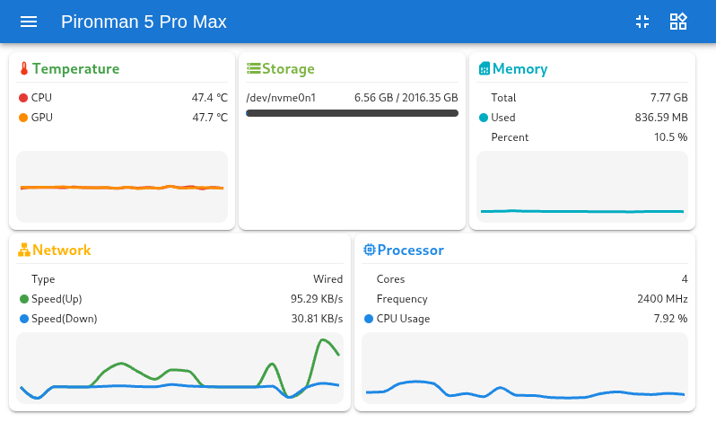
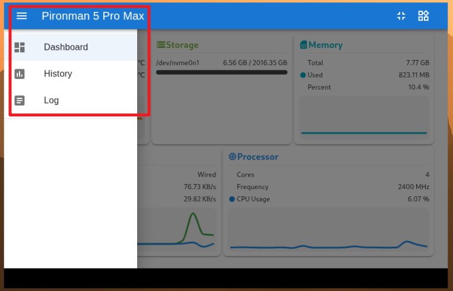
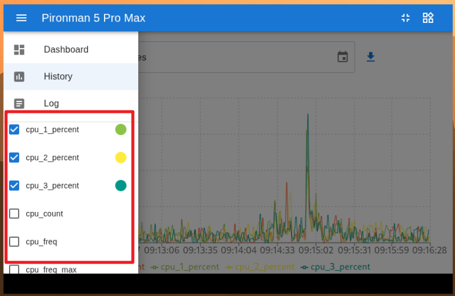
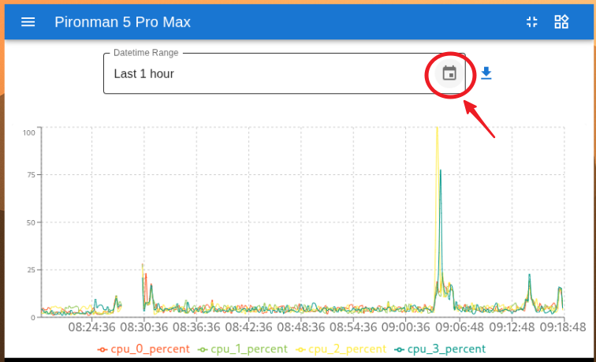
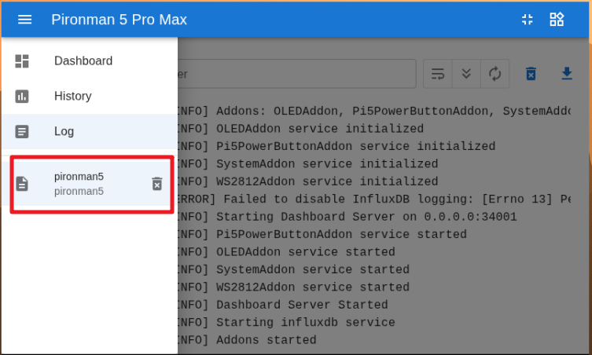
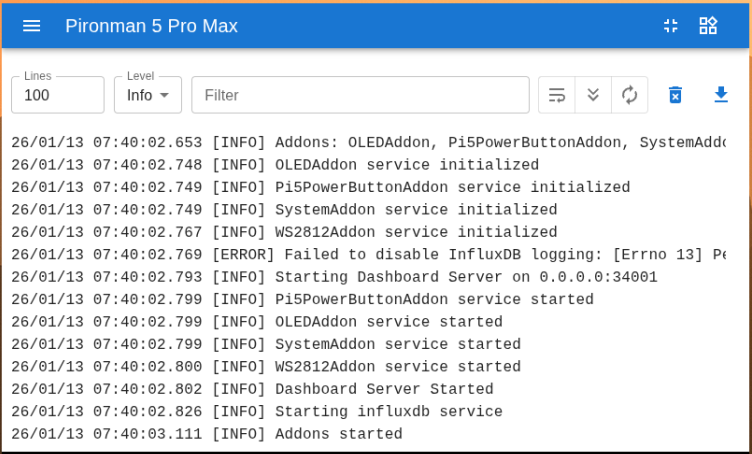
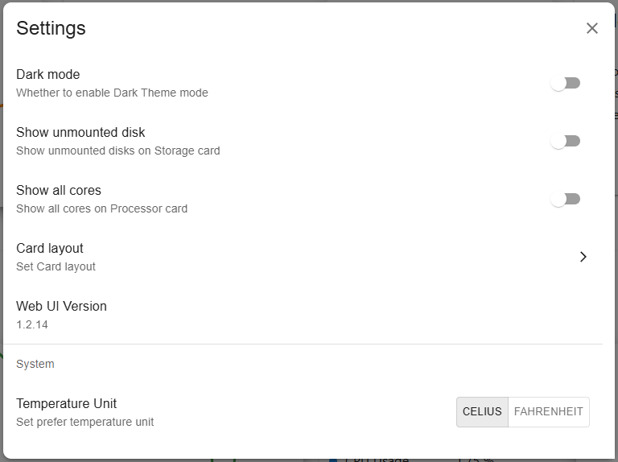
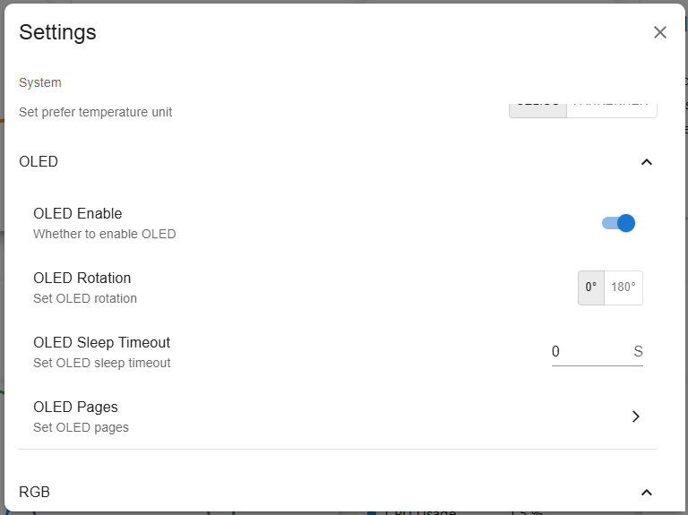
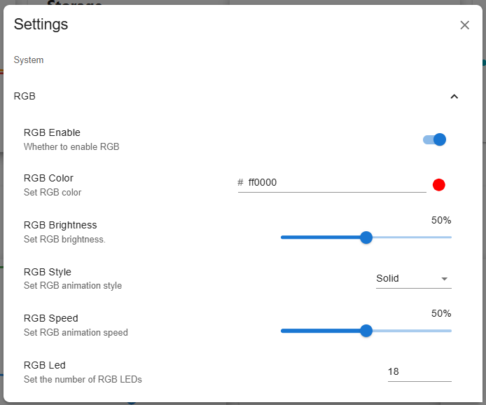
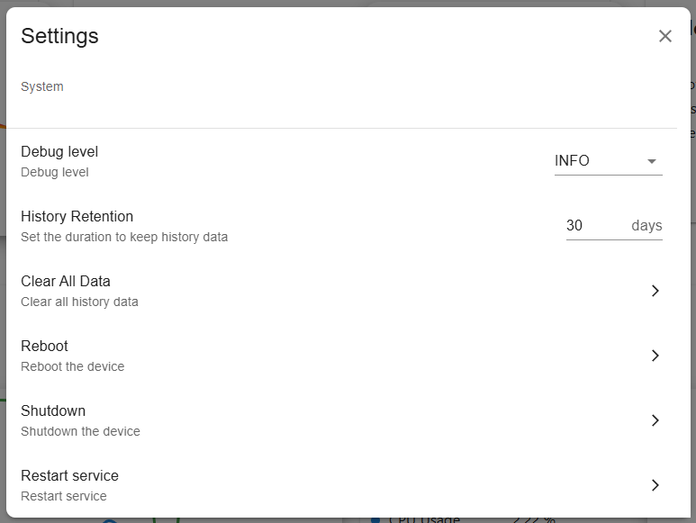

.. include:: /index.rst
   :start-after: start_hello_message
   :end-before: end_hello_message

.. _promax_view_control_dashboard:

Visualizzare e Controllare dalla Dashboard
========================================================

Una volta installato con successo il modulo ``pironman5``, il servizio ``pironman5.service`` si avvierà automaticamente al riavvio.

Ora puoi aprire la pagina di monitoraggio nel tuo browser per vedere le informazioni sul tuo Raspberry Pi, configurare i LED RGB, ecc. Il link della pagina è: ``http://<ip>:34001``.

Questa pagina ha **Dashboard**, **History**, **Log** e una pagina **Settings**.

Dashboard
-----------------------

Ci sono diverse schede per visualizzare lo stato rilevante del Raspberry Pi, inclusi:

* **Temperatura**: Visualizza la temperatura CPU e GPU del Raspberry Pi.

  .. image:: img/dashboard_temp.png
    :align: center

* **Archiviazione**: Mostra la capacità di archiviazione di un Raspberry Pi, mostrando varie partizioni del disco con il loro spazio utilizzato e disponibile.

  .. image:: img/dashboard_storage.png
    :align: center

* **Memoria**: Mostra l'utilizzo e la percentuale della RAM del Raspberry Pi.

  .. image:: img/dashboard_memory.png
    :align: center

* **Rete**: Mostra il tipo di connessione di rete corrente, le velocità di upload e download.

  .. image:: img/dashboard_network.png
    :align: center

* **Processore**: Illustra le prestazioni della CPU del Raspberry Pi, incluso lo stato dei suoi quattro core, le frequenze operative e la percentuale di utilizzo della CPU.

  .. image:: img/dashboard_processor.png
    :align: center

History
--------------

La pagina History ti permette di visualizzare i dati storici. Seleziona i dati che vuoi vedere nella barra laterale sinistra, poi scegli l'intervallo di tempo per vedere i dati di quel periodo, e puoi anche cliccare per scaricarli.

Log
------------

La pagina Log è utilizzata per visualizzare i log del servizio Pironman5 attualmente in esecuzione. Il servizio Pironman5 include molteplici sottoservizi, ciascuno con il proprio log. Seleziona il log che vuoi visualizzare e potrai vedere i dati del log sulla destra. Se è vuoto, potrebbe significare che non c'è contenuto nel log.

* Ogni log ha una dimensione fissa di 10MB. Quando supera questa dimensione, verrà creato un secondo log.
* Il numero di log per lo stesso servizio è limitato a 10. Se il numero supera questo limite, il log più vecchio verrà automaticamente eliminato.
* Ci sono strumenti di filtro sopra l'area del log sulla destra. Puoi selezionare il livello del log, filtrare per parole chiave e utilizzare diversi strumenti pratici, tra cui **Line Wrap**, **Auto Scroll** e **Auto Update**.
* I log possono anche essere scaricati localmente.

Settings
-----------------

C'è un menu delle impostazioni nell'**angolo in alto a destra** della pagina dove puoi personalizzare le impostazioni secondo le tue preferenze. Dopo aver effettuato le modifiche, le modifiche verranno salvate automaticamente. Se necessario, puoi cliccare sul pulsante CLEAR in basso per cancellare i dati storici.

* **Dark Mode**: Passa tra i temi chiaro e scuro. L'opzione del tema viene salvata nella cache del browser. Cambiare browser o cancellare la cache ripristinerà il tema chiaro predefinito.
* **Show Unmounted Disk**: Se mostrare o meno i dischi non montati nella dashboard.
* **Show All Cores**: Se mostrare o meno tutti i core nella dashboard.
* **Card layout**: Imposta il layout delle schede della dashboard.
* **Temperature Unit**: Imposta l'unità di temperatura visualizzata dal sistema.

**Informazioni sullo Schermo OLED**

* **OLED Enable**: Se abilitare o meno l'OLED.
* **OLED Rotation**: Imposta la rotazione dell'OLED.
* **OLED Sleep Timeout**: Imposta il timeout di sospensione dell'OLED.
* **OLED Page**: Imposta la pagina OLED da visualizzare: **System Mix**, **Performance Metrics**, **Disk Usage**, **IP Addresses**.

**Informazioni sui LED RGB**

* **RGB Enable**: Se abilitare o meno i LED RGB.
* **RGB Color**: Imposta il colore dei LED RGB.
* **RGB Brightness**: Puoi regolare la luminosità dei LED RGB con un cursore.
* **RGB Style**: Scegli la modalità di visualizzazione dei LED RGB. Le opzioni includono **Solid**, **Breathing**, **Flow**, **Flow_reverse**, **Rainbow**, **Rainbow Reverse** e **Hue Cycle**.
* **RGB Speed**: Imposta la velocità delle variazioni dei LED RGB.
* **RGB Led**: Imposta il numero di LED RGB da controllare.

**Informazioni sui Dati**

* **Debug Level**: Imposta il livello di debug. Le opzioni includono **Info**, **Warning**, **Error** e **Critical**.
* **History Retention**: Imposta il numero di giorni per conservare i dati storici.
* **Clear All Data**: Cancella tutti i dati storici.
* **Reboot**: Riavvia il sistema.
* **Shutdown**: Spegni il sistema.
* **Restart service**: Riavvia i servizi di sistema.

**Ventola**

Queste ventole si collegano a una porta dedicata per ventole PWM a 4 pin sul Raspberry Pi 5. La sua strategia di controllo predefinita è uno schema di regolazione della velocità intelligente a più livelli gestito dal firmware, basato sulla temperatura della CPU. Ciò significa che quando usi una ventola PWM ufficiale o compatibile e la colleghi correttamente, il sistema regolerà automaticamente la velocità della ventola in base alle variazioni della temperatura della CPU (iniziando a funzionare sopra i 50°C) senza alcun intervento manuale da parte tua.
