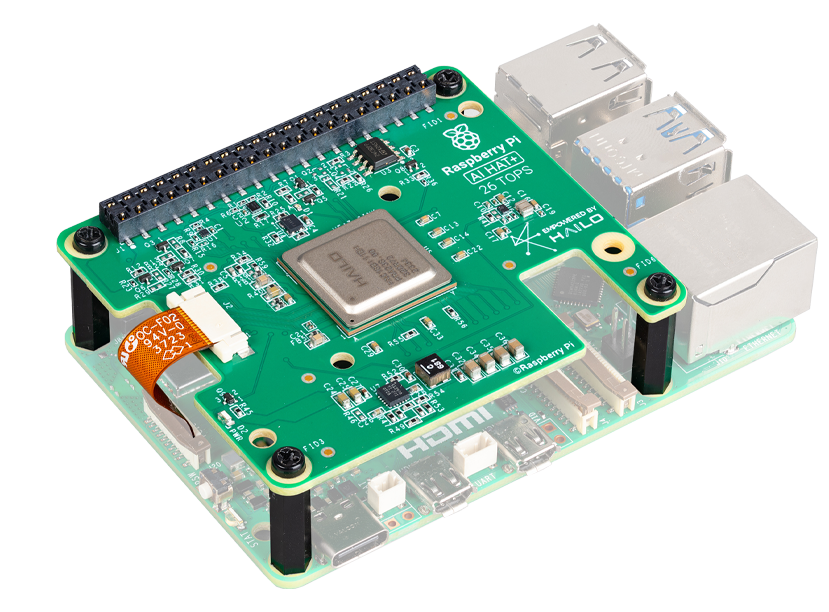
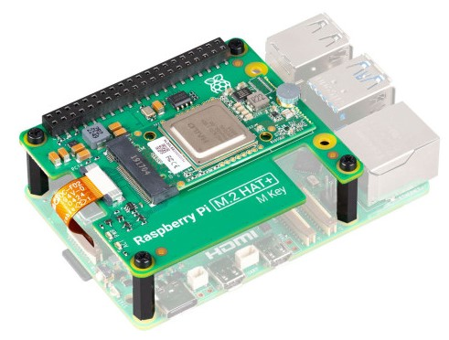
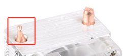

FAQ
============

1. 关于兼容系统
-------------------------------

以下系统已在 Raspberry Pi 5 上通过测试：

.. image:: img/compitable_os.png
   :width: 600
   :align: center

2. 关于电源按钮
--------------------------

该电源按钮实际上是 Raspberry Pi 5 的电源按钮引出，其行为与 Raspberry Pi 5 的电源按钮一致。

.. image:: img/power_button.jpg
    :width: 400
    :align: center

* **关机**

  * 如果运行 **Raspberry Pi OS Desktop** 系统，可以 **快速按两次电源按钮** 进行关机。
  * 如果运行 **Raspberry Pi OS Lite** 系统，**按一次电源按钮** 即可开始关机。
  * 若需要 **强制关机**，请 **长按电源按钮**。

* **开机**

  * 如果 Raspberry Pi 主板已关机但仍连接电源，**单击电源按钮** 即可重新启动。

* 如果使用的系统 **不支持关机按钮功能**，可以 **长按 5 秒强制关机**，再 **单击按钮开机**。

3. 关于 Raspberry Pi AI HAT+
----------------------------------------------------------

Raspberry Pi AI HAT+ **与 Pironman 5 不兼容**。

Raspberry Pi AI Kit 由 **Raspberry Pi M.2 HAT+** 和 **Hailo AI 加速模块** 组成。

你可以将 **Hailo AI 加速模块** 从 Raspberry Pi AI Kit 上拆下，然后直接插入 Pironman 5 MAX 的 **NVMe PIP 模块** 中使用。

4. 关于塔式散热器铜管末端
----------------------------------------------------------

塔式散热器顶部的 **U 形热管** 在生产过程中会进行压扁处理，以便铜管能够穿过铝制散热片，这是铜管生产过程中的正常工艺。

5. Raspberry Pi 5 无法启动（红灯）？
-------------------------------------------

该问题可能由 **系统更新、启动顺序更改或 Bootloader 损坏** 导致。可以尝试以下步骤解决：

#. 检查 USB-HDMI 适配板连接

   * 请仔细检查 USB-HDMI 适配板是否正确连接到 PI5。
   * 尝试拔下并重新插入 USB-HDMI 适配板。
   * 然后重新连接电源，检查 PI5 是否可以正常启动。

#. 在机箱外测试 PI5

   * 如果重新连接适配板仍无法解决问题：
   * 将 PI5 从 Pironman 5 机箱中取出。
   * 直接使用电源适配器给 PI5 供电（不安装在机箱内）。
   * 检查是否可以正常启动。

#. 恢复 Bootloader

   * 如果 PI5 仍然无法启动，可能是 Bootloader 损坏。
   * 可以参考指南： :ref:`update_bootloader_promax`，选择从 **SD 卡** 或 **NVMe/USB** 启动。
   * 将准备好的 SD 卡插入 PI5，通电启动并等待 **至少 10 秒**。
   * 恢复完成后，取出并重新格式化 SD 卡。
   * 使用 Raspberry Pi Imager 重新写入最新的 Raspberry Pi OS，再尝试启动系统。

6. OLED 屏幕无法工作？
------------------------------

.. note:: 为了节省电量，OLED 屏幕在一段时间无操作后可能会自动关闭。你可以轻轻敲击机箱，通过振动传感器唤醒屏幕。

如果 OLED 屏幕没有显示或显示异常，请按照以下步骤排查：

1. **检查 OLED 屏幕连接**

   确认 OLED 屏幕的 FPC 排线已正确连接且牢固。

2. **检查操作系统兼容性**

   确保你使用的是支持的 Raspberry Pi 操作系统。

3. **检查 I2C 地址**

   运行以下命令检查 OLED 的 I2C 地址（0x3C）是否被识别：

   .. code-block:: shell

      sudo i2cdetect -y 1

   如果未检测到地址，请使用以下命令启用 I2C：

   .. code-block:: shell

      sudo raspi-config

4. **重启 pironman5 服务**

   尝试重启 ``pironman5`` 服务：

   .. code-block:: shell

      sudo systemctl restart pironman5.service

5. **检查日志文件**

   如果问题仍然存在，请查看日志文件中的错误信息，并提供给技术支持：

   .. code-block:: shell

      cat /var/log/pironman5/pironman5.log

7. NVMe PIP 模块无法工作？
---------------------------------------

1. 确保连接 NVMe PIP 模块与 Raspberry Pi 5 的 FPC 排线已牢固连接。

   .. .. raw:: html

   ..     

   ..         <video center loop autoplay muted style="max-width:90%">
   ..             <source src="../_static/video/Nvme(1)-11.mp4" type="video/mp4">
   ..             Your browser does not support the video tag.
   ..         </video>
   ..     

   .. .. raw:: html

   ..     

   ..         <video center loop autoplay muted style="max-width:90%">
   ..             <source src="../_static/video/Nvme(2)-11.mp4" type="video/mp4">
   ..             Your browser does not support the video tag.
   ..         </video>
   ..     

.. todo 更新MP4

2. 确认 NVMe SSD 已牢固安装在 NVMe PIP 模块上。

3. 检查 NVMe PIP 模块指示灯状态：

   在确认所有连接正确后，启动 Pironman 5 MAX，并观察 NVMe PIP 模块上的两个指示灯：

   * **PWR LED**：应常亮  
   * **STA LED**：应闪烁，表示设备正常工作

   .. image:: img/dual_nvme_pip_leds.png

   * 如果 **PWR LED 亮但 STA LED 不闪烁**，说明 Raspberry Pi 未识别到 NVMe SSD。
   * 如果 **PWR LED 不亮**，请短接模块上的 **Force Enable** 引脚。如果短接后 **PWR LED 亮起**，则可能是 FPC 排线松动或系统不支持 NVMe。

   .. image:: img/dual_nvme_pip_j4.png

4. 确认 NVMe SSD 上已经正确安装操作系统。参考： :ref:`install_the_os_promax`。

5. 如果线路连接正确且操作系统已安装，但 NVMe SSD 仍无法启动，可以尝试使用 **Micro SD 卡启动系统** 来确认其他组件是否正常。确认无误后，再参考： :ref:`configure_boot_ssd_promax`。

如果完成以上步骤后问题仍然存在，请发送邮件至 **service@sunfounder.com**，我们会尽快回复。

8. RGB LED 不工作？
--------------------------

#. IO Expander 板上 **J9 上方的两个引脚** 用于将 RGB LED 连接到 GPIO10。请确认这两个引脚上的跳线帽已正确安装。

   .. image:: hardware/img/io_board_rgb_pin.png
      :width: 300
      :align: center

#. 确认 Raspberry Pi 正在运行兼容的操作系统。  
   Pironman 5 仅支持以下系统版本：

   .. image:: img/compitable_os.png
      :width: 600
      :align: center

   如果安装的是不支持的系统，请参考指南重新安装： :ref:`install_the_os_promax`。

#. 运行 ``sudo raspi-config`` 打开配置菜单，进入 **3 Interfacing Options → I3 SPI → YES** 启用 SPI，然后点击 **OK** 和 **Finish**。启用 SPI 后请重启 Pironman 5。

如果完成以上步骤后问题仍然存在，请发送邮件至 **service@sunfounder.com**。

9. CPU 风扇不工作？
----------------------------------------------

当 CPU 温度未达到设定阈值时，CPU 风扇不会启动，这是正常现象。

**基于温度的风扇速度控制**

PWM 风扇会根据 Raspberry Pi 5 的温度自动调整转速：

* **低于 50°C**：风扇关闭（0% 转速）  
* **50°C**：低速运行（30% 转速）  
* **60°C**：中速运行（50% 转速）  
* **67.5°C**：高速运行（70% 转速）  
* **75°C 及以上**：全速运行（100% 转速）

更多详情请参考： :ref:`fan`

10. 如何唤醒 OLED 屏幕？
---------------------------------------------------------------------------------

为了节省电量并延长屏幕寿命，OLED 屏幕在一段时间无操作后会自动关闭。这是正常设计，不会影响设备功能。

.. note::

   若需要配置 OLED 屏幕（如开关、休眠时间、旋转等），请参考：  
   :ref:`promax_view_control_dashboard` 或 :ref:`promax_view_control_commands`。

11. 如何关闭 Web Dashboard？
------------------------------------------------------

安装 ``pironman5`` 模块后，可以通过 :ref:`promax_view_control_dashboard` 访问 Web 控制面板。

如果不需要该功能并希望减少 CPU 和 RAM 占用，可以在安装 ``pironman5`` 时添加 ``--disable-dashboard`` 参数来禁用它：

.. code-block:: shell

   cd ~/pironman5
   sudo python3 install.py --disable-dashboard

如果已经安装了 ``pironman5``，可以删除 ``dashboard`` 模块和 ``influxdb``，然后重启 pironman5 服务以应用更改。

.. code-block:: shell
      
   /opt/pironman5/venv/bin/pip3 uninstall pm-dashboard influxdb
   sudo apt purge influxdb
   sudo systemctl restart pironman5

.. Does the Pironman 5 MAX support retro gaming systems?
.. ------------------------------------------------------
.. Yes, it is compatible. However, most retro gaming systems are streamlined versions that cannot install and run additional software. This limitation may cause some components on the Pironman 5 MAX, such as the OLED display, the two RGB fans, and the 4 RGB LEDs, to not function properly because these components require the installation of Pironman 5 MAX's software packages.

.. .. note::

..     The Batocera.linux system is now fully compatible with Pironman 5 MAX. Batocera.linux is an open-source and completely free retro-gaming distribution.

..     * :ref:`promax_install_batocera`
..     * :ref:`promax_set_up_batocera`

12. 如何使用 ``pironman5`` 命令控制组件
----------------------------------------------------------------------

你可以参考以下教程，通过 ``pironman5`` 命令来控制 Pironman 5 MAX 的各个组件：

* :ref:`promax_view_control_commands`

13. 如何使用命令修改 Raspberry Pi 启动顺序
-------------------------------------------------------------

如果你已经登录到 Raspberry Pi，可以通过命令行修改启动顺序。详细说明请参考：

* :ref:`configure_boot_ssd_promax`

14. 如何使用 Raspberry Pi Imager 修改启动顺序？
---------------------------------------------------------------

除了通过 EEPROM 配置修改 ``BOOT_ORDER`` 外，还可以使用 **Raspberry Pi Imager** 来更改 Raspberry Pi 的启动顺序。

建议在此步骤中使用一张 **备用存储卡**。

* :ref:`update_bootloader_promax`

15. 如何将系统从 SD 卡复制到 NVMe SSD？
-------------------------------------------------------------

如果你拥有 NVMe SSD，但没有适配器将 NVMe 连接到电脑，可以先将系统安装到 **Micro SD 卡**。  
当 Pironman 5 MAX 成功启动后，再将系统从 **Micro SD 卡复制到 NVMe SSD**。

详细教程请参考：

* :ref:`copy_sd_to_nvme_promax`

16. 如何移除亚克力面板的保护膜
-----------------------------------------------------------------

包装中包含两块亚克力面板，表面覆盖有 **黄色/透明保护膜** （两面均有），用于防止运输过程中被刮伤。  
保护膜可能比较难撕下，可以使用螺丝刀轻轻从角落处撬起，然后慢慢将整张保护膜揭下。

.. image:: img/peel_off_film.jpg
    :width: 500
    :align: center

.. _promax_openssh_powershell:

17. 如何在 PowerShell 中安装 OpenSSH？
--------------------------------------------------

当你使用以下命令连接 Raspberry Pi：

::

   ssh <username>@<hostname>.local
   ssh <username>@<IP address>

如果出现如下错误提示：

.. code-block::

   ssh: The term 'ssh' is not recognized as the name of a cmdlet, function, script file, or operable program.

说明你的 Windows 系统较旧，没有预装 `OpenSSH <https://learn.microsoft.com/en-us/windows-server/administration/openssh/openssh_install_firstuse?tabs=gui>`_，需要手动安装。

#. 在 Windows 搜索框中输入 ``powershell``，右键点击 **Windows PowerShell**，选择 **Run as administrator（以管理员身份运行）**。

   .. image:: img/powershell_ssh.png
      :width: 90%

#. 使用以下命令安装 ``OpenSSH.Client``：

   .. code-block::

      Add-WindowsCapability -Online -Name OpenSSH.Client~~~~0.0.1.0

#. 安装完成后会返回如下信息：

   .. code-block::

      Path          :
      Online        : True
      RestartNeeded : False

#. 使用以下命令验证安装：

   .. code-block::

      Get-WindowsCapability -Online | Where-Object Name -like 'OpenSSH*'

#. 如果显示如下结果，说明 ``OpenSSH.Client`` 已成功安装：

   .. code-block::

      Name  : OpenSSH.Client~~~~0.0.1.0
      State : Installed

      Name  : OpenSSH.Server~~~~0.0.1.0
      State : NotPresent

   .. warning::

      如果没有出现上述提示，说明 Windows 系统版本过旧，建议使用第三方 SSH 工具，例如 |link_putty|。

#. 重新启动 PowerShell，并继续以管理员身份运行。  
   此时即可使用 ``ssh`` 命令登录 Raspberry Pi，系统会提示输入之前设置的密码。

   .. image:: img/powershell_login.png

18. 如果我安装了 OMV，还可以使用 Pironman5 的功能吗？
--------------------------------------------------------------------------------------------------------

可以。OpenMediaVault 只是运行在 Raspberry Pi 系统上的一个服务。  
请按照 :ref:`promax_set_up_pi_os` 的步骤继续配置 Pironman5，即可正常使用其功能。

19. 树莓派摄像头无法工作？
----------------------------------------

当摄像头无法正常工作时，90% 的问题都与排线连接或摄像头硬件本身有关。

首先，请运行命令 ``rpicam-hello --list-cameras`` 以确认系统是否检测到了摄像头。如果检测成功，您应该会看到类似如下的提示信息：

.. code-block:: bash

   Available cameras
   -----------------
   0 : ov5647 [2592x1944] (/base/axi/pcie@1000120000/rp1/i2c@88000/ov5647@36)

如果未检测到摄像头，请检查排线是否插反或未完全插入。如果问题依然存在，请尝试更换排线或摄像头模组进行交叉测试。