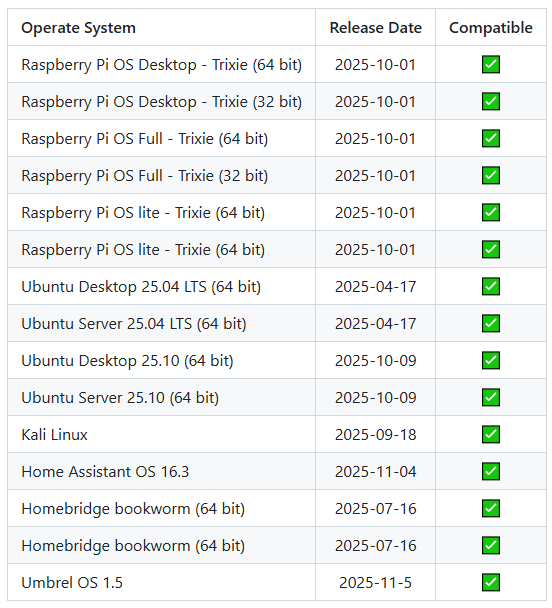
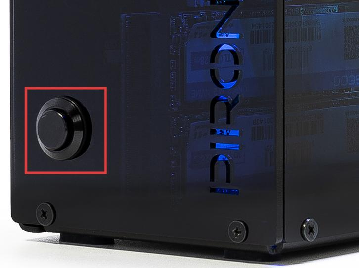

.. include:: /index.rst
   :start-after: start_hello_message
   :end-before: end_hello_message

FAQ
============

1. Über kompatible Systeme
-------------------------------

Systeme, die auf dem Raspberry Pi 5 getestet wurden:

2. Über den Netzschalter
--------------------------

Der Netzschalter führt den Netzschalter des Raspberry Pi 5 heraus und funktioniert genauso wie der Netzschalter des Raspberry Pi 5.

* **Herunterfahren**

  * Wenn Sie das System **Raspberry Pi OS Desktop** ausführen, können Sie den Netzschalter zweimal schnell hintereinander drücken, um herunterzufahren.
  * Wenn Sie das System **Raspberry Pi OS Lite** ausführen, drücken Sie den Netzschalter einmal, um ein Herunterfahren einzuleiten.
  * Um ein erzwungenes Herunterfahren durchzuführen, halten Sie den Netzschalter gedrückt.

* **Einschalten**

  * Wenn das Raspberry Pi-Board heruntergefahren, aber noch mit Strom versorgt ist, schaltet ein einzelner Tastendruck es aus dem heruntergefahrenen Zustand wieder ein.

* Wenn Sie ein System ausführen, das keinen Ausschaltknopf unterstützt, können Sie ihn 5 Sekunden lang gedrückt halten, um ein erzwungenes Herunterfahren zu erzwingen, und durch einmaliges Drücken aus dem heruntergefahrenen Zustand wieder einschalten.

3. Über das Raspberry Pi AI HAT+
----------------------------------------------------------

Das Raspberry Pi AI HAT+ ist nicht mit dem Pironman 5 kompatibel.

   .. image::  img/output3.png
        :width: 400

Das Raspberry Pi AI Kit kombiniert das Raspberry Pi M.2 HAT+ und das Hailo-AI-Beschleunigermodul.

   .. image::  img/output2.jpg
        :width: 400

Sie können das Hailo-AI-Beschleunigermodul vom Raspberry Pi AI Kit trennen und direkt in das NVMe-PIP-Modul des Pironman 5 MAX stecken.

   .. .. image::  img/output4.png
   ..      :width: 800

4. Über die Enden der Kupferrohre des Tower-Kühlers
----------------------------------------------------------

Die U-förmigen Heatpipes an der Oberseite des Tower-Kühlers sind zusammengedrückt, damit die Kupferrohre durch die Aluminiumlamellen geführt werden können. Dies ist ein normaler Teil des Produktionsprozesses für Kupferrohre.

   .. image::  img/tower_cooler1.png

5. PI5 startet nicht (rote LED)?
-------------------------------------------

Dieses Problem kann durch ein Systemupdate, Änderungen der Startreihenfolge oder einen beschädigten Bootloader verursacht werden. Sie können die folgenden Schritte versuchen, um das Problem zu beheben:

#. Überprüfen Sie die USB-HDMI-Adapterverbindung

   * Bitte überprüfen Sie sorgfältig, ob der USB-HDMI-Adapter fest mit dem PI5 verbunden ist.
   * Versuchen Sie, den USB-HDMI-Adapter zu trennen und wieder anzuschließen.
   * Schließen Sie dann die Stromversorgung wieder an und prüfen Sie, ob der PI5 erfolgreich bootet.

#. Testen Sie den PI5 außerhalb des Gehäuses

   * Wenn das erneute Anschließen des Adapters das Problem nicht löst:
   * Entfernen Sie den PI5 aus dem Pironman-5-Gehäuse.
   * Versorgen Sie den PI5 direkt mit dem Netzteil (ohne Gehäuse).
   * Prüfen Sie, ob er normal booten kann.

#. Stellen Sie den Bootloader wieder her

   * Wenn der PI5 immer noch nicht booten kann, ist möglicherweise der Bootloader beschädigt. Sie können dieser Anleitung folgen: :ref:`update_bootloader_promax` und wählen, ob von SD-Karte oder NVMe/USB gebootet werden soll.
   * Legen Sie die vorbereitete SD-Karte in den PI5 ein, schalten Sie ihn ein und warten Sie mindestens 10 Sekunden. Sobald die Wiederherstellung abgeschlossen ist, entfernen Sie die SD-Karte und formatieren Sie sie neu.
   * Verwenden Sie dann Raspberry Pi Imager, um das neueste Raspberry Pi OS zu flashen, legen Sie die Karte wieder ein und versuchen Sie erneut zu booten.

6. OLED-Bildschirm funktioniert nicht?
--------------------------------------------------------

.. note:: Der OLED-Bildschirm schaltet sich möglicherweise nach einer gewissen Inaktivität automatisch aus, um Strom zu sparen. Sie können leicht auf das Gehäuse tippen, um den Vibrationssensor auszulösen und den Bildschirm aufzuwecken.

Wenn der OLED-Bildschirm nichts anzeigt oder falsch anzeigt, folgen Sie diesen Schritten zur Fehlerbehebung:

1. **Überprüfen Sie die OLED-Bildschirmverbindung**

   Stellen Sie sicher, dass das FPC-Kabel des OLED-Bildschirms richtig angeschlossen ist.

   .. .. raw:: html

   ..     

   ..         <video center loop autoplay muted style="max-width:90%">
   ..             <source src="../_static/video/Oled-11.mp4" type="video/mp4">
   ..             Ihr Browser unterstützt das Video-Tag nicht.
   ..         </video>
   ..     

   .. todo MP4 aktualisieren

2. **Überprüfen Sie die Betriebssystemkompatibilität**

   Stellen Sie sicher, dass Sie ein kompatibles Betriebssystem auf Ihrem Raspberry Pi ausführen.

3. **Überprüfen Sie die I2C-Adresse**

   Führen Sie den folgenden Befehl aus, um zu prüfen, ob die I2C-Adresse (0x3C) des OLEDs erkannt wird:

   .. code-block:: shell

      sudo i2cdetect -y 1

   Wenn die Adresse nicht erkannt wird, aktivieren Sie I2C mit dem folgenden Befehl:

   .. code-block:: shell

      sudo raspi-config

4. **Starten Sie den pironman5-Dienst neu**

   Starten Sie den `pironman5`-Dienst neu, um zu sehen, ob das Problem dadurch behoben wird:

   .. code-block:: shell

      sudo systemctl restart pironman5.service

5. **Überprüfen Sie die Protokolldatei**

   Wenn das Problem weiterhin besteht, überprüfen Sie die Protokolldatei auf Fehlermeldungen und geben Sie die Informationen zur weiteren Analyse an den Kundendienst weiter:

   .. code-block:: shell

      cat /var/log/pironman5/pironman5.log

7. NVMe-PIP-Modul funktioniert nicht?
---------------------------------------

1. Stellen Sie sicher, dass das FPC-Kabel, das das NVMe-PIP-Modul mit dem Raspberry Pi 5 verbindet, fest angeschlossen ist.

   .. .. raw:: html

   ..     

   ..         <video center loop autoplay muted style="max-width:90%">
   ..             <source src="../_static/video/Nvme(1)-11.mp4" type="video/mp4">
   ..             Ihr Browser unterstützt das Video-Tag nicht.
   ..         </video>
   ..     

   .. .. raw:: html

   ..     

   ..         <video center loop autoplay muted style="max-width:90%">
   ..             <source src="../_static/video/Nvme(2)-11.mp4" type="video/mp4">
   ..             Ihr Browser unterstützt das Video-Tag nicht.
   ..         </video>
   ..     

.. todo MP4 aktualisieren

2. Bestätigen Sie, dass Ihre SSD sicher am NVMe-PIP-Modul befestigt ist.

3. Überprüfen Sie den Status der LEDs des NVMe-PIP-Moduls:

   Überprüfen Sie nach dem Bestätigen aller Verbindungen den Pironman 5 MAX und beobachten Sie die beiden Anzeigen auf dem NVMe-PIP-Modul:

   * **PWR-LED**: Sollte leuchten.
   * **STA-LED**: Sollte blinken, um den normalen Betrieb anzuzeigen.

   .. image:: img/dual_nvme_pip_leds.png

   * Wenn die **PWR-LED** leuchtet, die **STA-LED** jedoch nicht blinkt, bedeutet dies, dass die NVMe-SSD vom Raspberry Pi nicht erkannt wird.
   * Wenn die **PWR-LED** aus ist, schließen Sie die "Force Enable"-Pins auf dem Modul kurz. Wenn die **PWR-LED** aufleuchtet, könnte dies auf ein loses FPC-Kabel oder eine nicht unterstützte Systemkonfiguration für NVMe hindeuten.

   .. image:: img/dual_nvme_pip_j4.png

4. Bestätigen Sie, dass auf Ihrer NVMe-SSD ein ordnungsgemäß installiertes Betriebssystem vorhanden ist. Siehe: :ref:`install_the_os_promax`.

5. Wenn die Verkabelung korrekt ist und das Betriebssystem installiert ist, die NVMe-SSD aber dennoch nicht bootet, versuchen Sie, von einer Micro-SD-Karte zu booten, um die Funktionalität anderer Komponenten zu überprüfen. Fahren Sie nach der Bestätigung fort mit: :ref:`configure_boot_ssd_promax`.

Wenn das Problem nach Durchführung der oben genannten Schritte weiterhin besteht, senden Sie bitte eine E-Mail an service@sunfounder.com. Wir werden so schnell wie möglich antworten.

8. RGB-LEDs funktionieren nicht?
-----------------------------------------------------

#. Die beiden Pins auf dem IO-Expander über J9 werden verwendet, um die RGB-LEDs mit GPIO10 zu verbinden. Stellen Sie sicher, dass die Jumper-Kappe auf diesen beiden Pins richtig sitzt.

   .. image:: hardware/img/io_board_rgb_pin.png
      :width: 300
      :align: center

#. Überprüfen Sie, ob der Raspberry Pi ein kompatibles Betriebssystem ausführt. Der Pironman 5 unterstützt nur die folgenden Betriebssystemversionen:

   .. image:: img/compitable_os.png
      :width: 600
      :align: center

   Wenn Sie ein nicht unterstütztes Betriebssystem installiert haben, folgen Sie der Anleitung, um ein kompatibles Betriebssystem zu installieren: :ref:`install_the_os_promax`.

#. Führen Sie den Befehl ``sudo raspi-config`` aus, um das Konfigurationsmenü zu öffnen. Navigieren Sie zu **3 Schnittstellenoptionen** -> **I3 SPI** -> **JA**, klicken Sie dann auf **OK** und **Fertigstellen**, um SPI zu aktivieren. Starten Sie nach der Aktivierung von SPI den Pironman 5 neu.

Wenn das Problem nach Durchführung der oben genannten Schritte weiterhin besteht, senden Sie bitte eine E-Mail an service@sunfounder.com. Wir werden so schnell wie möglich antworten.

9. CPU-Lüfter funktioniert nicht?
----------------------------------------------

Wenn die CPU-Temperatur den eingestellten Schwellenwert noch nicht erreicht hat, wird der CPU-Lüfter nicht arbeiten.

**Lüftergeschwindigkeitsregelung basierend auf der Temperatur**

Der PWM-Lüfter arbeitet dynamisch und passt seine Geschwindigkeit entsprechend der Temperatur des Raspberry Pi 5 an:

* **Unter 50°C**: Lüfter bleibt aus (0% Geschwindigkeit).
* **Bei 50°C**: Lüfter arbeitet mit niedriger Geschwindigkeit (30% Geschwindigkeit).
* **Bei 60°C**: Lüfter erhöht auf mittlere Geschwindigkeit (50% Geschwindigkeit).
* **Bei 67,5°C**: Lüfter erhöht auf hohe Geschwindigkeit (70% Geschwindigkeit).
* **Bei 75°C und darüber**: Lüfter arbeitet mit voller Geschwindigkeit (100% Geschwindigkeit).

10. Wie wecke ich den OLED-Bildschirm auf?
---------------------------------------------------------------------------------

Um Strom zu sparen und die Lebensdauer des Bildschirms zu verlängern, schaltet sich der OLED-Bildschirm nach einer gewissen Inaktivität automatisch aus. Dies ist Teil des normalen Designs und beeinträchtigt nicht die Funktionalität des Produkts.

.. note::

   Informationen zur Konfiguration des OLED-Bildschirms (wie Ein-/Ausschalten, Schlafzeit, Drehung usw.) finden Sie unter: :ref:`promax_view_control_dashboard` oder :ref:`promax_view_control_commands`.

11. Wie deaktiviere ich das Web-Dashboard?
------------------------------------------------------

Sobald Sie die Installation des Moduls ``pironman5`` abgeschlossen haben, können Sie auf das :ref:`promax_view_control_dashboard` zugreifen.

Wenn Sie diese Funktion nicht benötigen und die CPU- und RAM-Auslastung reduzieren möchten, können Sie das Dashboard während der Installation von ``pironman5`` deaktivieren, indem Sie das Flag ``--disable-dashboard`` hinzufügen.

.. code-block:: shell

   cd ~/pironman5
   sudo python3 install.py --disable-dashboard

Wenn Sie ``pironman 5`` bereits installiert haben, können Sie das Modul ``dashboard`` und ``influxdb`` entfernen und dann pironman5 neu starten, um die Änderungen zu übernehmen:

.. code-block:: shell

   /opt/pironman5/venv/bin/pip3 uninstall pm-dashboard influxdb
   sudo apt purge influxdb
   sudo systemctl restart pironman5

12. Wie steuere ich Komponenten mit dem Befehl ``pironman5``?
----------------------------------------------------------------------
Sie können im folgenden Tutorial nachlesen, wie Sie die Komponenten des Pironman 5 MAX mit dem Befehl ``pironman5`` steuern können.

* :ref:`promax_view_control_commands`

13. Wie ändere ich die Startreihenfolge des Raspberry Pi mit Befehlen?
----------------------------------------------------------------------------------------

Wenn Sie bereits auf Ihrem Raspberry Pi angemeldet sind, können Sie die Startreihenfolge mit Befehlen ändern. Detaillierte Anweisungen finden Sie hier:

* :ref:`configure_boot_ssd_promax`

14. Wie ändere ich die Startreihenfolge mit Raspberry Pi Imager?
-----------------------------------------------------------------------------------------

Zusätzlich zum Ändern des ``BOOT_ORDER`` in der EEPROM-Konfiguration können Sie auch den **Raspberry Pi Imager** verwenden, um die Startreihenfolge Ihres Raspberry Pi zu ändern.

Es wird empfohlen, für diesen Schritt eine zusätzliche Karte zu verwenden.

* :ref:`update_bootloader_promax`

15. Wie kopiere ich das System von der SD-Karte auf eine NVMe-SSD?
----------------------------------------------------------------------------------------------

Wenn Sie eine NVMe-SSD besitzen, aber keinen Adapter haben, um Ihre NVMe mit Ihrem Computer zu verbinden, können Sie das System zunächst auf Ihrer Micro-SD-Karte installieren. Sobald der Pironman 5 MAX erfolgreich hochgefahren ist, können Sie das System von Ihrer Micro-SD-Karte auf Ihre NVMe-SSD kopieren. Detaillierte Anweisungen finden Sie hier:

* :ref:`copy_sd_to_nvme_promax`

16. Wie entferne ich die Schutzfolie von den Acrylplatten?
-----------------------------------------------------------------

Im Paket sind zwei Acrylplatten enthalten, die auf beiden Seiten mit einer gelben/transparenten Schutzfolie überzogen sind, um Kratzer zu vermeiden. Die Schutzfolie lässt sich möglicherweise etwas schwer entfernen. Kratzen Sie mit einem Schraubendreher vorsichtig an den Ecken und ziehen Sie dann die gesamte Folie vorsichtig ab.

.. _promax_openssh_powershell:

17. Wie installiere ich OpenSSH über Powershell?
--------------------------------------------------

Wenn Sie ``ssh <benutzername>@<hostname>.local`` (oder ``ssh <benutzername>@<IP-Adresse>``) verwenden, um eine Verbindung zu Ihrem Raspberry Pi herzustellen, aber die folgende Fehlermeldung erscheint.

    .. code-block::

        ssh: Der Begriff 'ssh' wird nicht als Name eines Cmdlets, einer Funktion, einer Skriptdatei oder eines ausführbaren Programms erkannt. Überprüfen Sie die
        Schreibweise des Namens, oder ob ein Pfad angegeben wurde, und vergewissern Sie sich, dass der Pfad korrekt ist, und versuchen Sie es erneut.

Das bedeutet, dass Ihr Computersystem zu alt ist und `OpenSSH <https://learn.microsoft.com/de-de/windows-server/administration/openssh/openssh_install_firstuse?tabs=gui>`_ nicht vorinstalliert ist. Sie müssen es manuell nach dem folgenden Tutorial installieren.

#. Geben Sie ``powershell`` in das Suchfeld Ihres Windows-Desktops ein, klicken Sie mit der rechten Maustaste auf ``Windows PowerShell`` und wählen Sie im erscheinenden Menü ``Als Administrator ausführen``.

   .. image:: img/powershell_ssh.png
      :width: 90%

#. Verwenden Sie den folgenden Befehl, um ``OpenSSH.Client`` zu installieren.

   .. code-block::

        Add-WindowsCapability -Online -Name OpenSSH.Client~~~~0.0.1.0

#. Nach der Installation wird die folgende Ausgabe zurückgegeben.

   .. code-block::

        Path          :
        Online        : True
        RestartNeeded : False

#. Überprüfen Sie die Installation mit dem folgenden Befehl.

   .. code-block::

        Get-WindowsCapability -Online | Where-Object Name -like 'OpenSSH*'

#. Jetzt wird angezeigt, dass ``OpenSSH.Client`` erfolgreich installiert wurde.

   .. code-block::

        Name  : OpenSSH.Client~~~~0.0.1.0
        State : Installed

        Name  : OpenSSH.Server~~~~0.0.1.0
        State : NotPresent

   .. warning::

        Wenn die obige Meldung nicht erscheint, ist Ihr Windows-System immer noch zu alt, und es wird empfohlen, ein SSH-Tool eines Drittanbieters wie |link_putty| zu installieren.

#. Starten Sie nun PowerShell neu und führen Sie es weiterhin als Administrator aus. Jetzt sollten Sie sich mit dem Befehl ``ssh`` bei Ihrem Raspberry Pi anmelden können. Sie werden aufgefordert, das zuvor festgelegte Passwort einzugeben.

   .. image:: img/powershell_login.png

18. Wenn ich OMV eingerichtet habe, kann ich dann trotzdem die Funktionen des Pironman5 nutzen?
--------------------------------------------------------------------------------------------------------

Ja, OpenMediaVault wird auf dem Raspberry-Pi-System eingerichtet. Bitte folgen Sie den Schritten unter :ref:`promax_set_up_pi_os`, um die Konfiguration fortzusetzen.