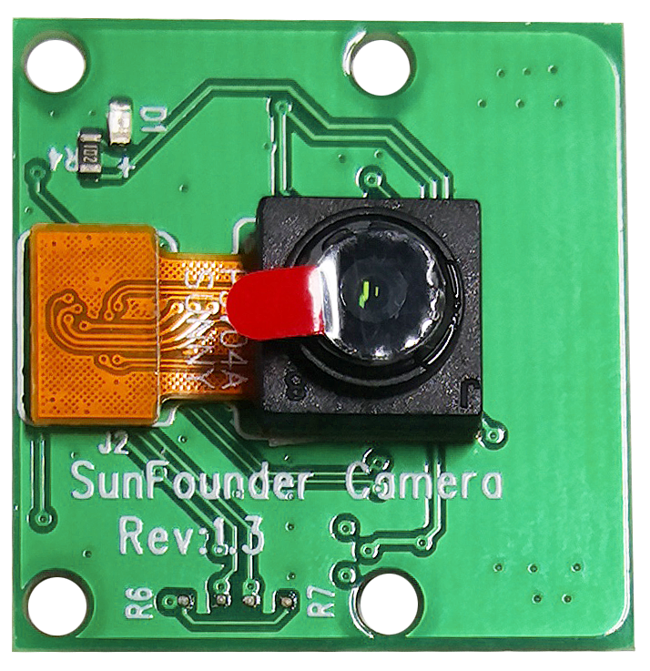
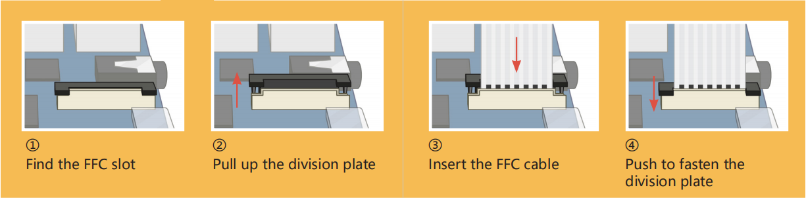
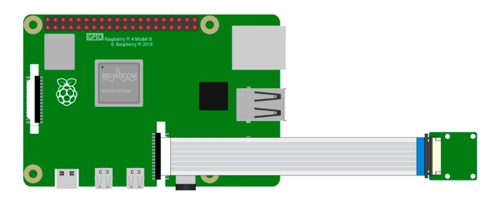

.. _cpn_camera_module:

摄像头模块
====================================

**描述**

这是一个配备 OV5647 传感器的 500 万像素 Raspberry Pi 摄像头模块。即插即用，只需将随附的排线连接到 Raspberry Pi 的 CSI（Camera Serial Interface）接口即可使用。

该模块体积小巧，尺寸约为 25mm × 23mm × 9mm，重量仅 3g，非常适合对尺寸和重量要求较高的应用场景，例如移动设备或嵌入式项目。该摄像头模块的原生分辨率为 500 万像素，配备板载定焦镜头，可拍摄 2592 × 1944 分辨率的静态图像，同时支持 1080p30、720p60 和 640×480p90 视频录制。

.. note:: 

   该模块仅支持拍摄图片和视频，不支持录音。

**规格参数**

* **静态图像分辨率**：2592×1944 
* **支持的视频分辨率**：1080p/30 fps、720p/60 fps、640×480p 60/90 视频录制
* **光圈（F 值）**：1.8 
* **视角**：65° 
* **尺寸**：24mm × 23.5mm × 8mm 
* **重量**：3g 
* **接口**：CSI 接口 
* **支持系统**：Raspberry Pi OS（建议使用最新版本）

**安装摄像头模块**
-------------------------------------

在摄像头模块或 Raspberry Pi 上可以找到一个扁平的塑料接口。先轻轻向外拉出黑色固定卡扣，使其处于半弹出状态。然后按照图示方向将 FFC 排线插入塑料接口中，再将固定卡扣压回原位。

如果 FFC 排线安装正确，它会保持平直，并且在轻轻拉动时不会松脱。如果没有安装正确，请重新安装。

   

.. warning::

   请勿在通电状态下安装摄像头，否则可能损坏摄像头模块。