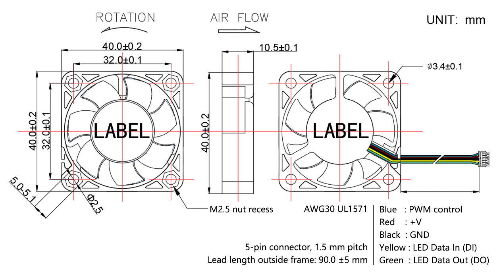
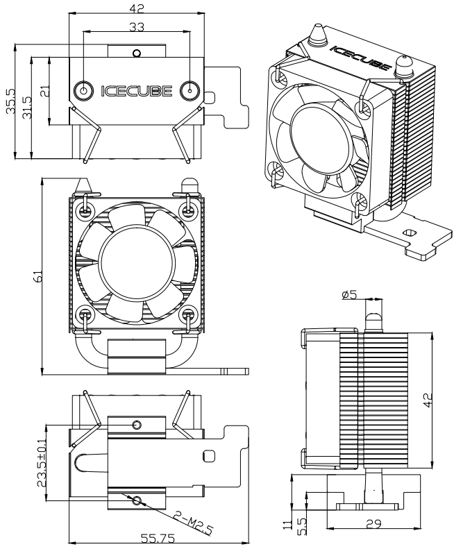

.. include:: /index.rst
   :start-after: start_hello_message
   :end-before: end_hello_message

ファン
============

PWMファン
-----------

Pironman 5 Pro MAX には 3基の PWM ファンが搭載されています。

Pironman 5 Pro MAX の PWM ファンは、Raspberry Pi システムによって制御されます。

Raspberry Pi 5 の冷却ソリューション、特に高負荷時において、Pironman 5 Pro MAX の設計にはスマート冷却システムが組み込まれています。主 PWM ファン 1基と補助 RGB ファン 2基を特徴とし、冷却戦略は Raspberry Pi 5 の温度管理システムと緊密に統合されています。

PWM ファンの動作は Raspberry Pi 5 の温度に基づいています：

* 50°C 未満では、PWM ファンはオフのままです（速度 0%）。
* 50°C で、ファンは低速で回転を開始します（速度 30%）。
* 60°C に達すると、ファンは中速に上がります（速度 50%）。
* 67.5°C で、ファンは高速に上がります（速度 70%）。
* 75°C 以上では、ファンは全速で動作します（速度 100%）。

この温度と速度の関係は、5°C のヒステリシスを持って温度が下がる場合にも適用されます。ファン速度は、これらの各しきい値を 5°C 下回った時点で低下します。

* PWM ファンを監視するコマンド。PWM ファンのステータスを確認するには：

  .. code-block:: shell
  
    cat /sys/class/thermal/cooling_device0/cur_state

* PWM ファンの速度を表示するには：

  .. code-block:: shell

    cat /sys/devices/platform/cooling_fan/hwmon/*/fan1_input

Pironman 5 Pro MAX において、PWM ファンは、特に高負荷タスク時における最適な動作温度の維持に不可欠なコンポーネントであり、Raspberry Pi 5 が効率的かつ確実に動作することを保証します。

**ファン仕様**

* **外形寸法**: 40*40*10MM
* **定格入力電力**: 5V/0.106A
* **定格速度**: 4000RPM
* **重量**: 13.5±5g/pcs
* **寿命**: 30,000 時間（室温 25°C）
* **騒音レベル**: 22.31dBA
* **最大風量**: 2.46CFM
* **最大静圧**: 0.62mm-H2O
* **動作温度**: -10℃~+60℃
* **保管温度**: -20℃~+70℃

**ピン定義**

.. list-table:: 
   :widths: 25 25 50
   :header-rows: 1

   * - ピン
     - 色
     - 説明
   * - 1
     - 青
     - ファン速度制御用 PWM 信号
   * - 2
     - 赤
     - 5V 電源
   * - 3
     - 黒
     - グランド
   * - 4
     - 黄
     - 内部 RGB LED のデータ入力
   * - 5 
     - 緑
     - 内部 RGB LED のデータ出力

タワークーラー
----------------------------

Pro MAX において、タワークーラーは、高負荷タスク時にも Raspberry Pi 5 を最適な温度に保つように設計された高性能冷却ソリューションです。大型アルミニウム製ヒートシンクと、必要に応じて冷却性能を調整できる PWM 制御可能なファンを特徴としています。タワークーラーは Raspberry Pi 5 と互換性があり、付属のネジと取り付けブラケットを使用して簡単に取り付けることができます。

**警告**

ファンの羽根に触れたり、電源ワイヤーがファンに絡まったり、電源ワイヤーを無理に引っ張ったりしないでください。ファンを損傷する恐れがあります。

可燃性ガスがある環境や危険を伴う環境では使用しないでください。

ファンが動作しているときは、ファンを長時間ロックしようとしないでください。ロックすると、連続停止によって発生する高熱によりファンが焼損します。

ファンを組み立てる際は、共振や振動によるノイズに特に注意してください。

Icecube Tower Cooler を高所から落下させないでください。ファンの羽根のバランスに影響を与える可能性があります。