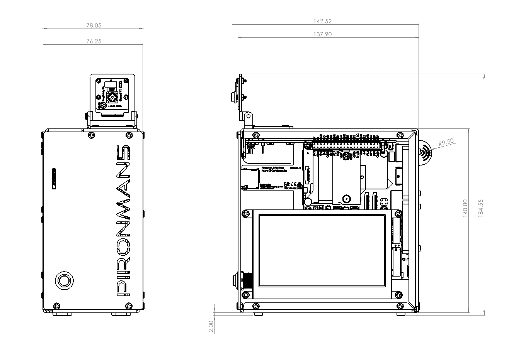

.. include:: /index.rst
   :start-after: start_hello_message
   :end-before: end_hello_message

Caratteristiche
======================

**Specifiche**

* **Dimensioni**: 140,9 x 77,0 x 138,7 mm
* **Materiale**:

    * Telaio Principale: Lega di Alluminio Anodizzato Scuro
    * Pannelli Laterali: Acrilico Scuro

* **Piattaforma Supportata**: Solo Raspberry Pi 5
* **Alimentazione**: USB Type-C, 5V/5A (Minimo 27W raccomandato)
* **Interfacce e Porte**:

    * **GPIO a 40 pin del Raspberry Pi** (esteso esternamente con etichette chiare)
    * **Slot MicroSD** (con meccanismo di espulsione a molla)
    * **Pannello Posteriore**:

        * Ingresso Alimentazione USB Type-C
        * 2 x USB 2.0
        * 2 x USB 3.0
        * Gigabit Ethernet (RJ45)
        * 2 x Porte HDMI Standard (Tipo A) (supporto 4Kp60)

* **Sistema di Raffreddamento**:

    * 1 x Grande Dissipatore a Torre con Ventola Controllata da PWM
    * 3 x Ventole PWM RGB Indirizzabili (controllate da GPIO, sincronizzabili)

* **Display e Multimediali**:

    * Touchscreen capacitivo DSI da 4,3 pollici (800 x 480 pixel)
    * Display OLED da 0,96 pollici (128x64) per statistiche di sistema
    * Altoparlanti Stereo da 3W
    * Supporto per Modulo Fotocamera da 5 Megapixel

* **Archiviazione ed Espansione**:

    * Switch PCIe Gen 2 Integrato
    * 2 x Slot M.2 M-key PCIe 2.0 x1
    * Dimensioni SSD/Scheda AI Supportate: 2230, 2242, 2260, 2280

* **Controlli, Illuminazione e Funzionalità**:

    * 18 LED RGB Indirizzabili WS2812B: 6 sulla scheda e 12 integrati nelle ventole RGB.
    * Ricevitore IR (38kHz)
    * Pulsante di Accensione in Metallo (funzione di spegnimento sicuro)
    * Supporto per Batteria RTC (Real-Time Clock) (per cella CR1220)

* **Qualità Costruttiva**: Corpo in alluminio CNC di precisione con finestre in acrilico scuro temprato, progettato per durata ed estetica sofisticata.

**Disegno Dimensionale**

