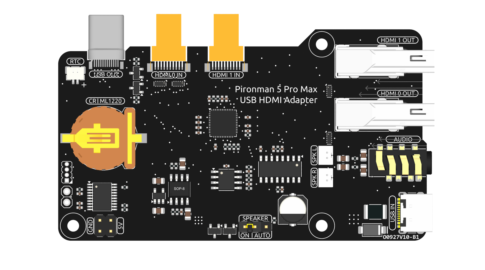
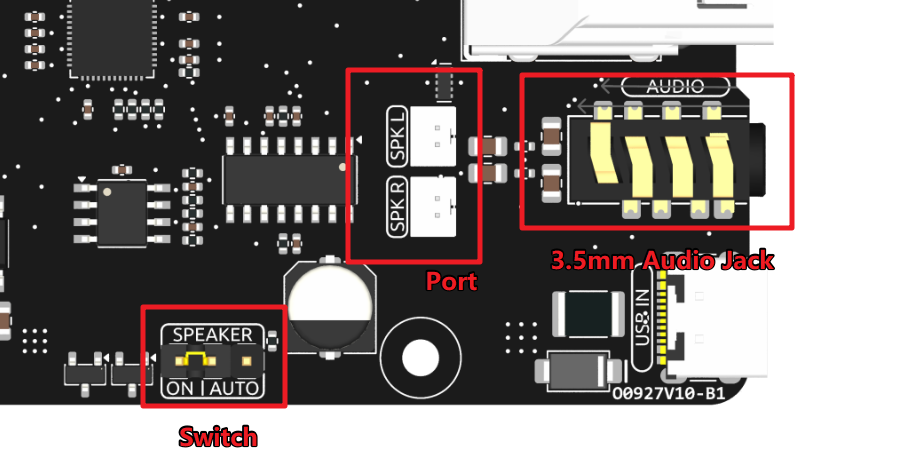

.. include:: /index.rst
   :start-after: start_hello_message
   :end-before: end_hello_message

USB HDMI Adapter
==========================================

This USB HDMI adapter board is specifically designed for the Raspberry Pi 5. Its primary function is to reposition the USB and HDMI connections to align with the USB interface side of the Raspberry Pi, enhancing accessibility and cable management.

Additionally, the HDMI port is converted to a standard HDMI Type A interface, offering broader compatibility.

**NVMe Additional Power Supply**

The board features a 5V power header specifically for NVMe PIP power supply. Coupled with an extension header, it can be connected to the NVMe's additional power interface to provide extra power.

**1220RTC Battery Holder**

A 1220RTC battery holder is incorporated for convenient installation of an RTC battery. It connects to the Raspberry Pi's RTC interface via an SH1.0 2P reverse cable. 

The battery holder is compatible with both CR1220 and ML1220 batteries. If using an ML1220 (Lithium Manganese Dioxide battery), charging can be configured directly on the Raspberry Pi. Note that the CR1220 is not rechargeable.

**Enabling Trickle Charging**

.. warning::

  If you're using a CR1220 battery, do not enable trickle charging as it can cause irreparable damage to the battery and risk damaging the board.

By default, the trickle charging feature for the battery is disabled. The ``sysfs`` files indicate the current trickle charging voltage and limits:

.. code-block:: shell

    pi@raspberrypi:~ $ cat /sys/devices/platform/soc/soc:rpi_rtc/rtc/rtc0/charging_voltage
    0
    pi@raspberrypi:~ $ cat /sys/devices/platform/soc/soc:rpi_rtc/rtc/rtc0/charging_voltage_promax
    4400000
    pi@raspberrypi:~ $ cat /sys/devices/platform/soc/soc:rpi_rtc/rtc/rtc0/charging_voltage_min
    1300000

To enable trickle charging, add ``rtc_bbat_vchg`` to ``/boot/firmware/config.txt``:

  * Open the ``/boot/firmware/config.txt``.
  
    .. code-block:: shell
    
      sudo nano /boot/firmware/config.txt
      
  * Add ``rtc_bbat_vchg`` to ``/boot/firmware/config.txt``.
  
    .. code-block:: shell
    
      dtparam=rtc_bbat_vchg=3000000
  
After rebooting, the system will display:

.. code-block:: shell

    pi@raspberrypi:~ $ cat /sys/devices/platform/soc/soc:rpi_rtc/rtc/rtc0/charging_voltage
    3000000
    pi@raspberrypi:~ $ cat /sys/devices/platform/soc/soc:rpi_rtc/rtc/rtc0/charging_voltage_promax
    4400000
    pi@raspberrypi:~ $ cat /sys/devices/platform/soc/soc:rpi_rtc/rtc/rtc0/charging_voltage_min
    1300000

This confirms the battery is now under trickle charging. To disable this feature, simply remove the ``dtparam`` line from ``config.txt``.

Audio Interface
---------------------------------

This section covers the audio output features of the board, including the speaker output and headphone jack.

**Speaker Port**

The board features a dual-channel speaker output interface that supports two 4Ω 3W speakers.

**Speaker Switch**

The speaker audio signal originates from the HDMI0 source. If HDMI0 is connected to a display with built-in speakers, both the Pironman 5 Pro Max speakers and the display speakers may play audio simultaneously. The **SPEAKER** jumper allows you to control this behavior.

*   Connect the jumper to the left two pins (**ON**) to keep the speakers **always enabled**.
*   Connect the jumper to the right two pins (**AUTO**) to have the speakers **automatically disabled** when headphones are inserted or when HDMI0 is connected.

Therefore, if you wish to use the onboard speakers while an HDMI display is connected, you can either:

*   Connect the display to the **HDMI1** port instead.
*   Set the **SPEAKER** jumper to the **ON** position.

**3.5mm Audio Jack**

The headphone jack shares the same audio source as the speakers but carries an **unamplified** signal. It uses a switched jack, which automatically **disables the speaker amplifier** when headphones are inserted, preventing both from playing sound simultaneously.

The jack is a 4-pin TRRS connector but supports **standard stereo audio output only**:

*   **Tip (T):** Left Channel
*   **Ring 1 (R1):** Right Channel
*   **Ring 2 (R2):** Ground
*   **Sleeve (S):** Ground

This configuration maintains compatibility with most common 4-pin headphone standards.

