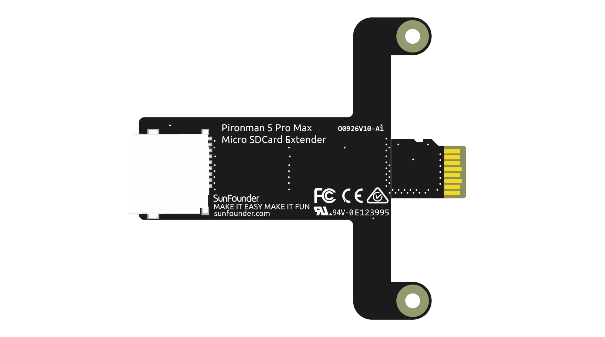

.. include:: /index.rst
   :start-after: start_hello_message
   :end-before: end_hello_message

Extensor de MicroSD
=======================

Esta es una placa de expansión de tarjeta Micro SD, que extiende la ranura para tarjeta MicroSD de la Raspberry Pi al exterior y añade una ranura para tarjeta con mecanismo de resorte.

