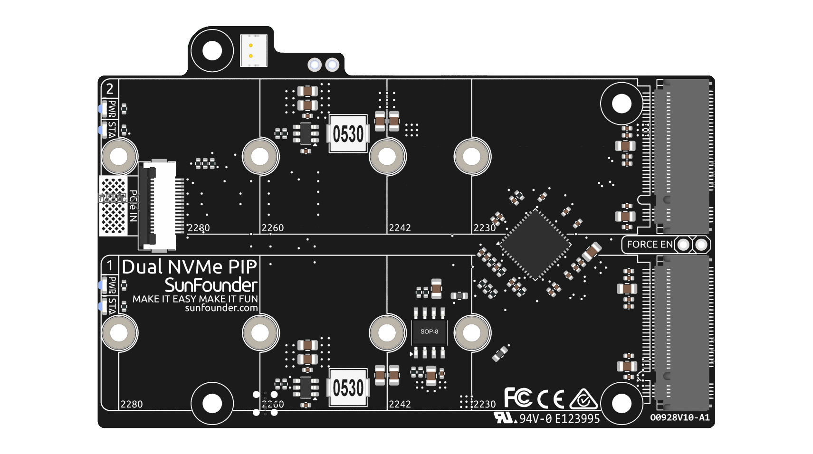

Dual NVMe PIP
=====================

**Dual NVMe PIP** （PCIe 外设板，PCIe Peripheral Board）由 Raspberry Pi 基金会定义，是专为 NVMe 固态硬盘设计的 PCIe 适配器。 :contentReference[oaicite:0]{index=0}

Raspberry Pi 5 的 PCIe 接口原生提供单条 **Gen2 x1** 通道（500 MB/s）。通过集成 **ASM1182e** PCIe 交换芯片，Dual NVMe PIP 可以将其扩展为 **两条独立的 Gen2 x1 通道**，从而允许连接：

* **两个 M.2 NVMe SSD**，或
* **一个 M.2 NVMe SSD + 一个 M.2 Hailo-8 / 8L AI 加速卡**

**关键说明**：

* 不支持 Gen3
* 支持 NVMe SSD 尺寸：**2230、2242、2260、2280** （均为 M.2 M-key 插槽）

* 该板通过 **16P 0.5mm 反向 FFC（柔性扁平线）** 或定制的 **阻抗匹配 FPC（柔性印刷电路）** 连接。
* **STA**：状态指示 LED。
* **PWR**：电源指示 LED。
* 板载 3.3V 电源最大可提供 3A 输出。但由于 Raspberry Pi 的 PCIe 接口仅能提供 **5V/1A（约 5W）**，若需要 3.3V/3A 的额外供电，可以通过 **J3 接口** 接入 5V 电源。
* **FORCE ENABLE**：板载电源由 PCIe 接口的开关信号控制。当 Raspberry Pi 启动后，会发送信号启用 3.3V 电源。如果某些系统不支持该开关信号，可以通过焊接方式短接 **J4 FORCE ENABLE** 的两个焊盘，以强制启用板载 3.3V 电源为 NVMe 供电。

关于型号
---------------------------

M.2 SSD 以体积小巧著称，根据连接器的 **Key（缺口）类型** 和接口不同，可分为多种类型。主要包括：

* **M.2 SATA SSD**：使用 SATA 接口，与 2.5 英寸 SATA SSD 类似，但采用更小的 M.2 形态。其速度受 SATA III 限制，最大约 600 MB/s。通常兼容 B Key 和 M Key 插槽。
* **M.2 NVMe SSD**：通过 PCIe 通道使用 NVMe 协议，速度远高于 M.2 SATA SSD，适用于游戏、视频编辑以及数据密集型任务。通常需要 M Key 插槽。这类硬盘使用 PCIe（Peripheral Component Interconnect Express）接口，并存在 3.0、4.0、5.0 等版本，每一代 PCIe 的数据传输速度几乎翻倍。不过 Raspberry Pi 5 使用的是 PCIe 3.0 接口，理论最高传输速度约为 3500 MB/s。

M.2 SSD 常见的 Key 类型包括 **B Key、M Key 和 B+M Key**。后来出现的 **B+M Key** 结合了 B Key 与 M Key 的功能，因此逐渐取代单独的 B Key。请参考下图。

.. image:: img/ssd_key.png

一般来说，M.2 SATA SSD 为 **B+M Key** （可插入 B Key 或 M Key 插槽），而 PCIe 3.0 x4 的 M.2 NVMe SSD 通常为 **M Key**。

关于长度
-----------------------

M.2 模块具有多种尺寸，也常用于 Wi-Fi、WWAN、蓝牙、GPS 和 NFC 等设备。

Pironman 5 MAX 支持四种（PCIe Gen 2.0）NVMe M.2 SSD 尺寸：2230、2242、2260 和 2280。其中 “22” 表示宽度（毫米），后两位数字表示长度。SSD 越长，可容纳的 NAND 闪存芯片越多，因此容量通常也更大。

.. image:: img/m2_ssd_size.png
  :width: 600

电源
-----------------------

板载双路 3.3V 电源最大支持 3A（10W）输出，两路电源彼此独立工作，互不干扰。

**FORCE ENABLE**  
板载电源通过 PCIe 接口的开关信号启用。当 Raspberry Pi 启动后，该信号会开启 3.3V 电源。如果系统不支持该信号或由于其他原因无法启用，可以短接 **J4 FORCE EN** 跳线，以强制启用板载 3.3V 电源为 NVMe 供电。

**LED**  
每个接口都有独立的电源指示灯（PWR）和状态指示灯（STA）。

电源开关转换器
-------------------------------

**添加电源按钮**

* Raspberry Pi 5 提供了一个 **J2** 跳线，位于 RTC 电池接口和主板边缘之间。该接口允许通过在两个焊盘之间连接一个常开（NO）的瞬时开关来添加自定义电源按钮。短按该开关即可模拟板载电源按钮的功能。

   .. image:: img/pi5_j2.jpg

* 在 Pironman 5 中，提供了一个 **Power Switch Converter**，通过两个 Pogo Pin 将 **J2** 跳线引出到外部电源按钮。

   .. image:: img/psc.png

* 因此，现在可以通过 **Power Button** 控制 Raspberry Pi 5 的开机和关机。

**电源循环**

当 Raspberry Pi 5 首次接通电源时，无需按下按钮，它会自动启动并进入操作系统。

如果运行 Raspberry Pi Desktop 系统，短按电源按钮会触发安全关机流程。此时会出现一个菜单，提供 **关机、重启或注销** 等选项。选择其中一个选项或再次按下电源按钮即可执行安全关机。

.. image:: img/button_shutdown.png

**关机**

    * 如果运行 **Raspberry Pi OS Desktop**，快速连续按两次电源按钮即可关机。 
    * 如果运行 **Raspberry Pi OS Lite** （无桌面环境），按一次电源按钮即可开始关机流程。
    * 若需要强制关机，可以长按电源按钮。

**开机**

    * 当 Raspberry Pi 已关机但仍然供电时，单击电源按钮即可重新启动。

.. note::

    如果使用的系统不支持电源按钮关机功能，可以长按 5 秒强制关机，然后单击电源按钮重新开机。