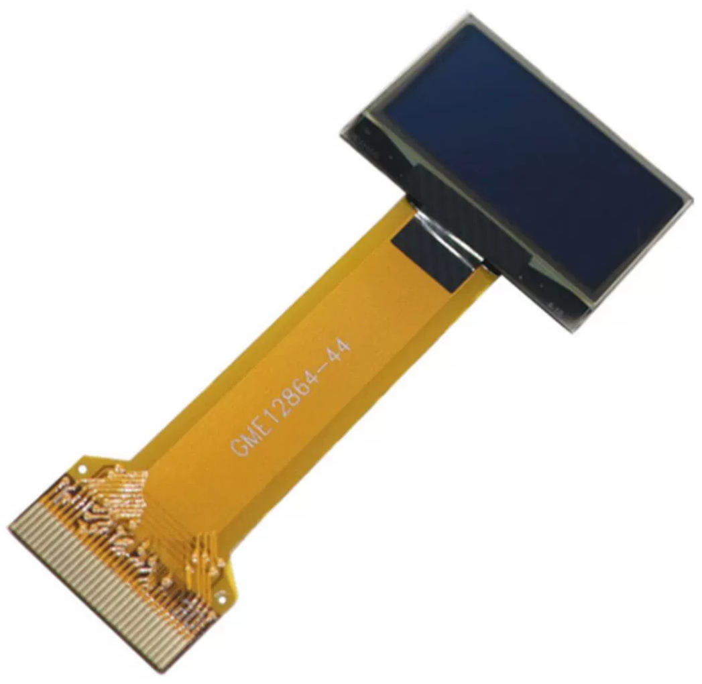

.. include:: /index.rst
   :start-after: start_hello_message
   :end-before: end_hello_message

OLEDスクリーン
===================

    

* **サイズ**: 0.96インチ
* **材質**: PM OLED
* **色**: 白色光
* **ドライバ**: SSD1306
* **電圧**: 3.3V
* **解像度**: 128×64
* **表示領域**: 21.74×10.86mm
* **パネルサイズ**: 26.70×19.26×1.42mm
* **画素ピッチ**: 0.17×0.17mm
* **画素サイズ**: 0.154×0.154mm
* **視野角**: 全方向
* **動作温度**: -20～70℃
* **通信方式**: IIC/SPI/パラレル
* **接続方法**: 0.5mmピッチプラグイン型FPC