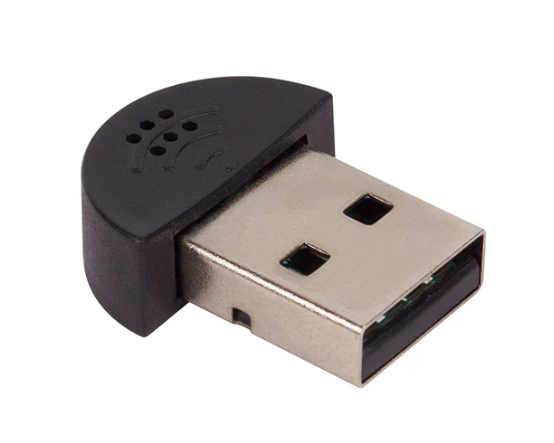

.. include:: /index.rst
   :start-after: start_hello_message
   :end-before: end_hello_message

Microphone USB Mini
===================================

**Description**

Ce microphone USB Mini prêt à l'emploi ne nécessite aucun pilote, et son interface USB signifie que vous pouvez l'utiliser avec n'importe quel ordinateur, ordinateur portable, SBC, etc. !
Il fonctionne très bien avec un Raspberry Pi, mais vous pouvez également l'utiliser avec n'importe quel autre ordinateur sur lequel vous souhaitez enregistrer de l'audio. Il suffit de le brancher et vous êtes prêt à enregistrer votre podcast, chanson, poésie parlée, livre audio, ou tout ce que votre cœur désire ! Si vous devez être un peu plus près de la source audio, vous pouvez l'associer à un câble d'extension USB ou à un adaptateur pivotant USB.
Veuillez noter que ce microphone est mieux utilisé sur un port qui n'est pas proche du ventilateur de refroidissement de votre ordinateur.

**Caractéristiques**

* Fonctionne sans pilote : branchez-le simplement sur votre PC Windows pour obtenir un microphone instantané
* Idéal pour les logiciels de dictée vocale ou Skype
* Portable, laissez-le branché sur votre ordinateur portable/notebook
* Le microphone omnidirectionnel à réduction de bruit capte le son à des distances plus longues
* Dimensions : 22,0 mm x 19,0 mm x 7,0 mm / 0,87" x 0,75" x 0,28"
* Poids : 3 g / 0,11 oz
* Type d'interface : USB