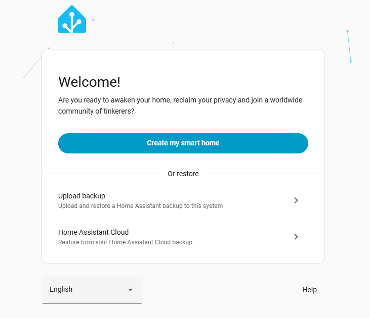
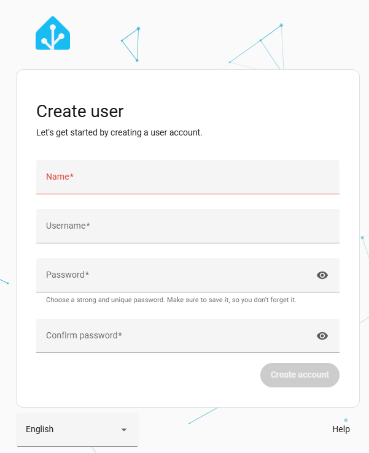
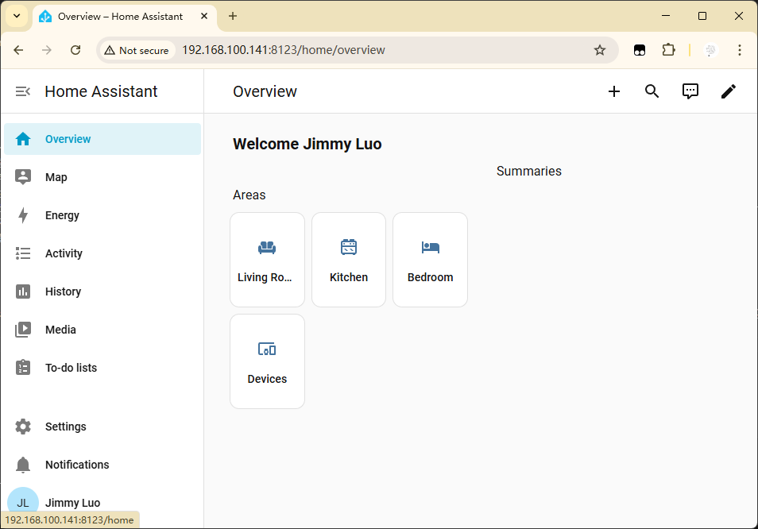

.. include:: /index.rst
   :start-after: start_hello_message
   :end-before: end_hello_message

Setting up Home Assistant
======================================

Home Assistant is a home automation platform running on top of a central hub (Raspberry Pi, PC, etc.). It can be used to control and monitor all kinds of devices, from lights and thermostats to security cameras and smart home appliances.

**Preparation**

Before you start, make sure you have the following:

* A Raspberry Pi that can run Home Assistant.
* A stable internet connection.
* An account on Home Assistant Cloud (optional, but recommended for remote access).

**Installation**

Open the terminal and enter the following commands:

1. Install Docker

.. code-block:: bash

   curl -sSL https://raw.githubusercontent.com/sunfounder/sunfounder-installer-scripts/main/install_docker.sh | sudo bash

2. Install Home Assistant

.. code-block:: bash

   sudo docker pull homeassistant/home-assistant

**Run Home Assistant Container**

Here, we use Docker Compose to run Home Assistant. You can think of Docker Compose as an "automation script." It will write all the configurations (such as image name, ports, volume mounts, environment variables, etc.) into a ``docker-compose.yml`` file. After that, with just a simple command ``docker compose up -d``, Docker will automatically create and start all configured containers according to this "script."

1.  **Enter the project directory**: Go into that folder.

   .. code-block:: bash

      cd ~/homeassistant

2.  **Create the configuration file**: In the ``~/homeassistant`` directory, create a file named ``docker-compose.yml`` and copy the above configuration into it.

   .. code-block:: bash

      sudo nano docker-compose.yml

3. Paste the following content into the ``docker-compose.yml`` file:

   .. note:: Please replace the ``- TZ=Asia/Shanghai`` with your timezone.

   .. code-block:: bash

      version: '3'
      services:
      homeassistant:
         image: ghcr.io/home-assistant/raspberrypi5-64-homeassistant:stable
         container_name: homeassistant
         restart: unless-stopped
         privileged: true
         network_mode: host
         environment:
            - TZ=Asia/Shanghai
         volumes:
            - ./config:/config

4. ``Ctrl+X`` to exit the editor, and then press ``Y`` to save the changes.

5.  **Start Home Assistant**: In the ``~/homeassistant`` directory, run the following command. Docker Compose will automatically pull the image and start the container.

   .. code-block:: bash

      sudo docker compose up -d

   * ``up``: Create and start services.
   * ``-d``: Run in the background (detached mode).
   

6.  **Check the running status**:

    .. code-block:: bash

      docker compose ps

   You should see the status of ``homeassistant`` as ``Up``.

7.  **View the logs** (if there are startup issues):

   .. code-block:: bash

      docker compose logs -f

8. For more command, please check:

   .. code-block:: bash

      docker compose --help

**Setting Up**

Now, you can open your computer's browser and enter: ``http://<Your Raspberry Pi Address>:8123`` to access Home Assistant.

Select **CREATE MY SMART HOME**, and then create your account.

Follow the prompts to choose your location and other configurations. Once completed, you will enter the Home Assistant dashboard.

