.. _promax_omv_5_promax:

设置 OpenMediaVault
=====================================

.. warning::

   OpenMediaVault **不支持** 在 Raspberry Pi OS Desktop 上安装。

   ⚠️ **仅支持 Raspberry Pi OS Lite 版本 11（Bullseye）和 12（Bookworm）。** 

   请确保已安装正确的操作系统并完成网络配置。
   此处的安装步骤与 :ref:`install_os_sd_rpi_promax` 一致，但在选择系统镜像时，请从 Raspberry Pi OS（other）中选择 Raspberry Pi OS Lite。

   .. image:: img/omv/omv-install-1.png

OpenMediaVault（简称 OMV）是一款基于 Debian Linux 的开源网络附加存储（NAS）操作系统，专为家庭用户和小型办公环境设计，旨在简化存储管理并提供丰富的网络服务功能。

请按照以下步骤在 Raspberry Pi 上安装 OpenMediaVault：

1. 通过 SSH 连接到 Raspberry Pi
-----------------------------------------------------------

   在终端中输入以下命令：

   .. code-block:: bash

      ssh pi@raspberrypi.local

   如果使用 Windows，请使用 PuTTY 或其他 SSH 客户端连接 Raspberry Pi。

2. 安装 OpenMediaVault
----------------------------

   在终端中输入以下命令：

   .. code-block:: bash

      wget https://github.com/OpenMediaVault-Plugin-Developers/installScript/raw/master/install  
      chmod +x install  
      sudo ./install -n

   该命令将下载并运行 OpenMediaVault 的安装脚本。安装完成后 **不要重启 Raspberry Pi**。

3. 访问 OpenMediaVault
-----------------------------

   在浏览器中输入以下地址访问 OpenMediaVault：

   .. code-block:: bash

      http://raspberrypi.local

   .. note:: 如果无法访问上述地址，请尝试使用 IP 地址，例如：http://192.168.1.100。

   您将看到登录页面，请使用默认用户名和密码登录。默认用户名为 ``admin``，密码为 ``openmediavault``。

   .. image:: img/omv/omv-login.png

   登录后，您将看到 OpenMediaVault 的主界面。

   .. image:: img/omv/omv-main.png

   至此，您已成功安装并访问 OpenMediaVault，现在可以开始配置和管理您的存储服务。

4. 设置 RAID（可选）
---------------------------------------

   NVMe RAID 是一种将多个 NVMe 固态硬盘（SSD）通过 RAID 技术组合在一起的存储方案，旨在充分发挥 NVMe 协议的高速性能，同时利用 RAID 的冗余或性能增强特性。常见模式包括 RAID 0、RAID 1、RAID 5、RAID 10 等。对于双 NVMe SSD，最常用的是 RAID 0 和 RAID 1。

   * RAID 0 是一种条带化技术，将数据分割成多个数据块并分布到多个硬盘上，从而提升读写速度。但 RAID 0 不提供冗余保护，一旦任意一块硬盘损坏，所有数据都会丢失。

   * RAID 1 是一种镜像技术，将数据复制到多个硬盘上，从而提供冗余保护。RAID 1 的读写性能取决于单块硬盘的性能。如果其中一块硬盘损坏，其他硬盘仍可继续提供数据。

   .. note:: RAID 0 或 RAID 1 至少需要挂载 2 块硬盘。在 RAID 0 中，阵列容量为所有硬盘容量之和；在 RAID 1 中，阵列容量等于最小容量硬盘的容量。

   1. 在 ``System`` 菜单中点击 ``Plugins``，搜索 ``openmediavault-md`` 插件并安装。

   .. image:: img/omv/omv-raid-1.png

   2. 在 ``Storage`` 菜单中点击 ``Disks``，清除两块 SSD。

   .. image:: img/omv/omv-raid-2.png

   3. 请注意，此操作会清除硬盘上的所有数据，请确保已备份重要数据。

   .. image:: img/omv/omv-raid-3.png

   4. 擦除模式选择 ``QUICK`` 即可。

   .. image:: img/omv/omv-raid-4.png

   5. 进入 ``Multiple Device`` 标签页，点击 ``Create``。

   .. image:: img/omv/omv-raid-5.png

   6. 在 Level 选项中选择 Stripe（RAID 0）或 Mirror（RAID 1）。在 Devices 选项中选择刚刚清除的硬盘。点击 ``Save`` 并等待 RAID 配置完成。

   .. image:: img/omv/omv-raid-6.png

   .. note:: 如果出现错误提示（500 - Internal Server Error），请尝试重启 OMV 系统。

   7. 点击 ``Apply`` 按钮应用配置。

   .. image:: img/omv/omv-raid-7.png

   8. RAID 配置完成后，需要等待状态达到 ``100%``。

   .. image:: img/omv/omv-raid-8.png

   9. 完成后，您的硬盘已组成 RAID 0 或 RAID 1 阵列，可以作为一个统一的存储设备使用。

5. 配置存储
-----------------------

   在 OpenMediaVault 主界面中，点击左侧菜单的 ``Storage``。在 ``Storage`` 页面中，点击 ``Disks`` 标签页。在该页面中，您可以看到 Raspberry Pi 上的所有磁盘。请确认 NVMe PIP 已连接硬盘。

   .. image:: img/omv/omv-disk.png

   1. 在侧边栏中点击 ``File System``，然后创建并挂载文件系统。文件系统类型选择 ``ext4``。

   .. image:: img/omv/omv-mount.png

   2. 选择设备并保存。

   .. note:: 如果已经配置了 RAID，列表中会显示 RAID 设备，直接选择并保存即可。

   .. image:: img/omv/omv-mount-2.png

   3. 系统会弹出窗口提示正在创建文件系统，请稍等片刻。

   .. image:: img/omv/omv-mount-3.png

   4. 完成后进入 ``Mount`` 页面，选择刚创建的文件系统并将其挂载到 Raspberry Pi。

   .. image:: img/omv/omv-mount-4.png

   .. note:: 如果使用双硬盘（未配置 RAID），请重复上述步骤，将第二块硬盘同样挂载。

   5. 挂载完成后，点击 ``Apply``，即可在文件系统中查看硬盘数据。

   .. image:: img/omv/omv-mount-5.png

   至此，您已成功完成 OpenMediaVault 的配置并挂载硬盘，现在可以使用 OMV 管理您的存储设备。

6. 创建共享文件夹
---------------------------------------

1. 在 ``Storage`` 页面中，进入 ``Shared Folders`` 选项卡，然后点击 ``Create`` 按钮。

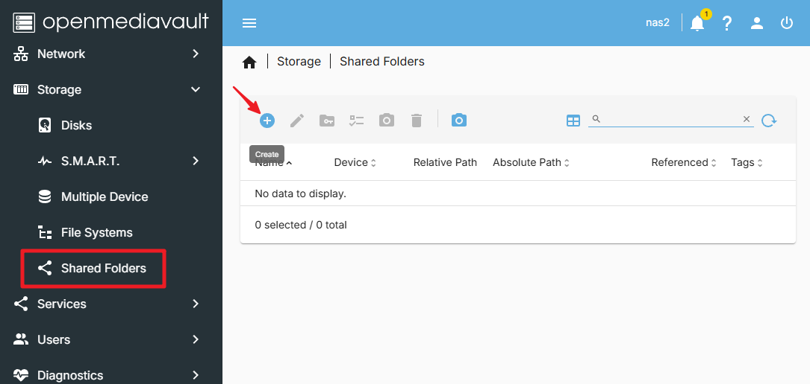

2. 在 ``Create Shared Folder`` 页面中，输入共享文件夹名称，选择要共享的硬盘，设置共享文件夹路径以及权限，然后点击 ``Save`` 按钮。

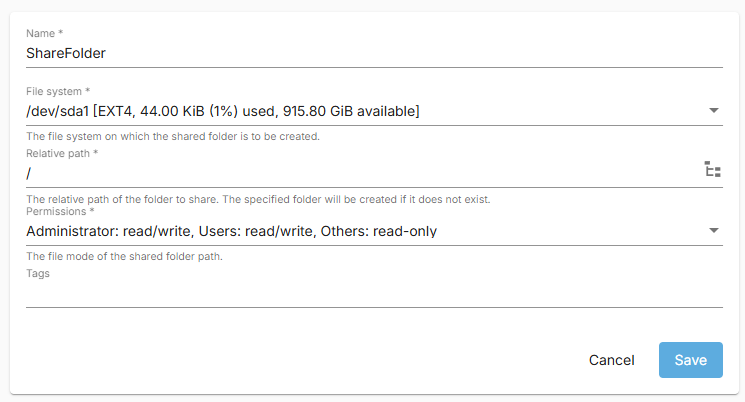

3. 现在可以看到刚创建的共享文件夹。确认信息无误后点击应用（Apply）。

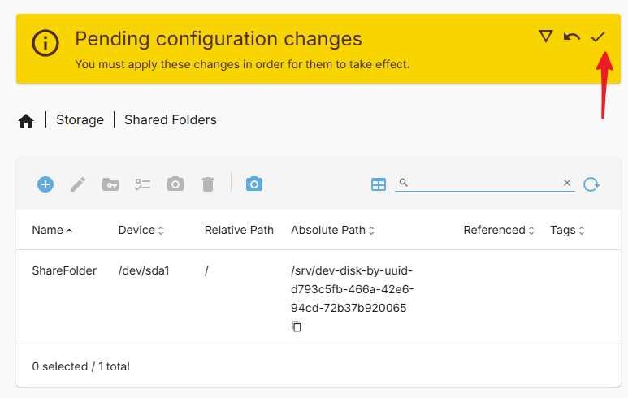

至此，共享文件夹已成功创建。

7. 创建新用户
---------------------------------------

为了访问共享文件夹，需要创建一个新用户，请按照以下步骤操作：

1. 在 ``User`` 页面中，点击 ``Create`` 按钮。

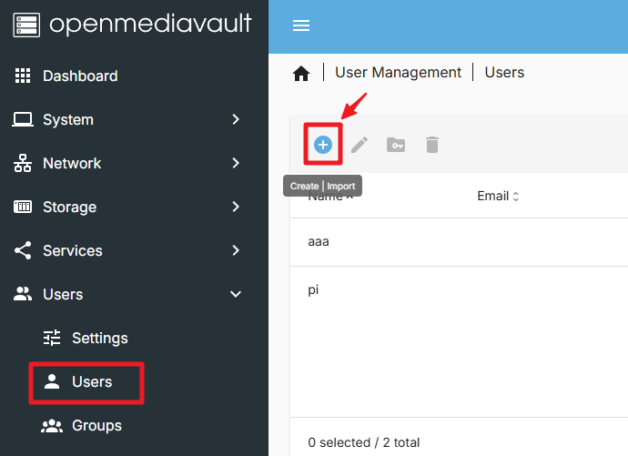

2. 在 ``Create User`` 页面中，输入新用户的用户名和密码，然后点击 ``Save`` 按钮。

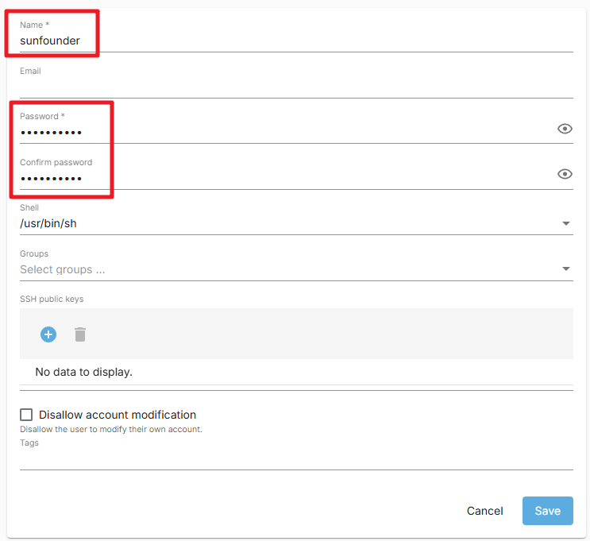

至此，新用户已成功创建。

8. 为新用户设置权限
---------------------------------------

1. 在 ``Shared Folders`` 页面中，点击刚刚创建的共享文件夹，然后点击 ``Permissions`` 按钮。

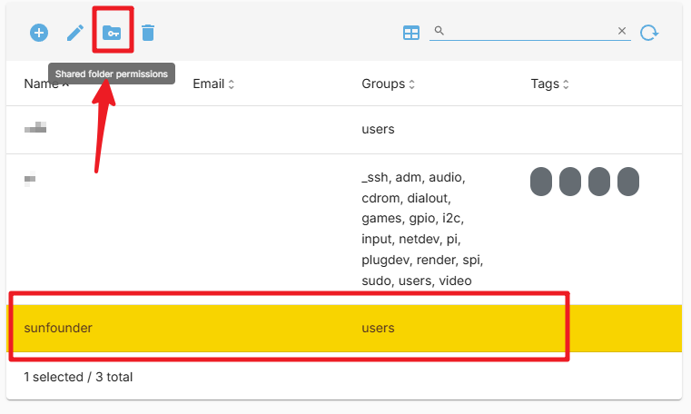

2. 在 ``Permissions`` 页面中设置权限，然后点击 ``Save`` 按钮。

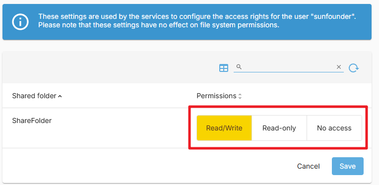

3. 完成后点击 ``Apply`` 按钮。

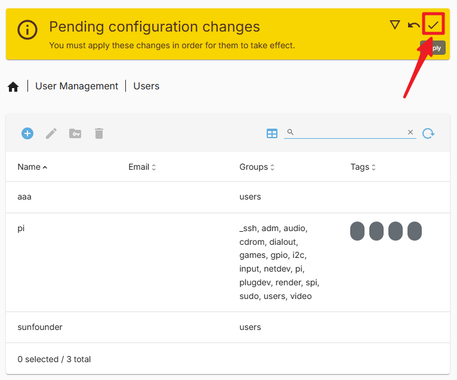

现在您可以使用这个新用户访问共享文件夹。

9. 配置 SMB 服务
---------------------------------------

1. 在 ``Services`` 页面中，找到 ``SMB/CIFS`` → ``Setting`` 选项卡，勾选 ``Enable``，然后点击 ``Save``。

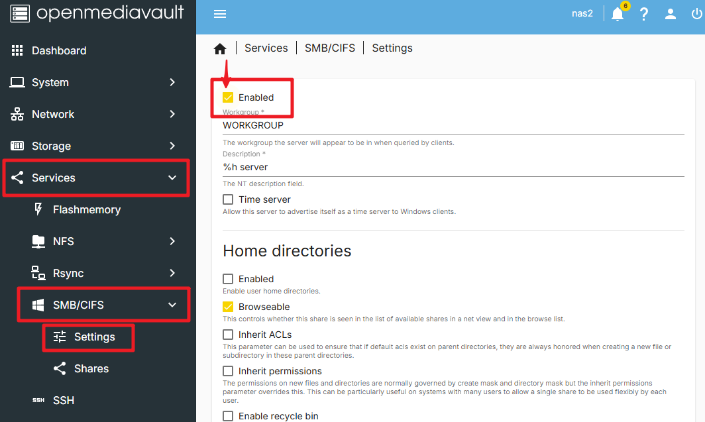

2. 点击 ``Apply`` 应用更改。

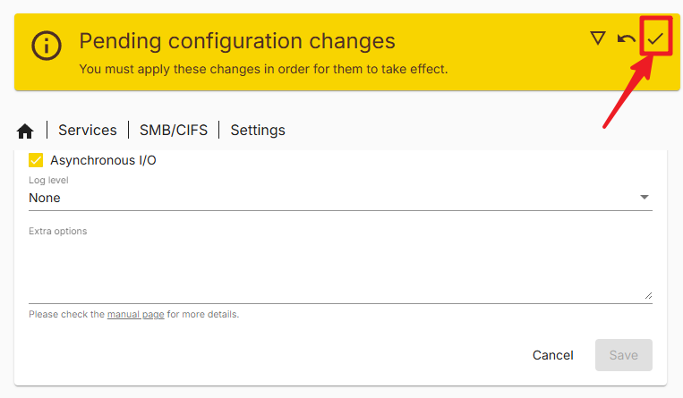

3. 进入 ``Shares`` 页面，点击 ``Create`` 按钮。

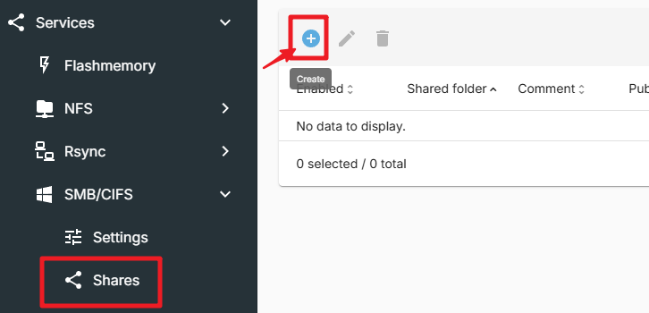

4. 在 ``Create Share`` 页面中，选择共享文件夹路径，然后点击 ``Save``。该页面还有许多其他选项，可根据需要进行配置。

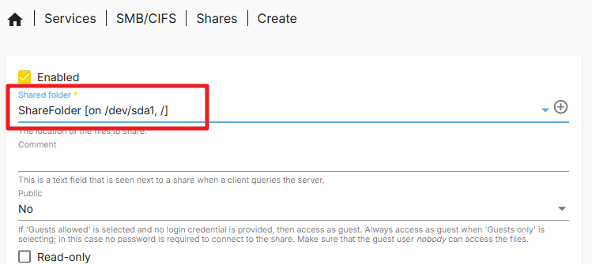

5. 点击 ``Apply``。

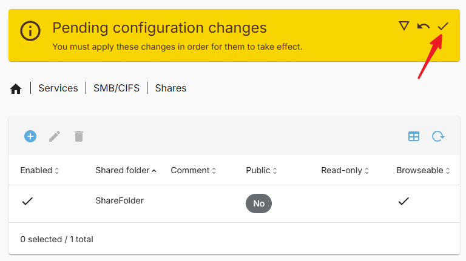

至此，SMB 服务已成功配置。现在可以通过 SMB 协议访问您的共享文件夹。

10. 在 Windows 上访问共享文件夹
---------------------------------------

1. 打开 ``此电脑（This PC）``，然后点击 ``映射网络驱动器（Map network drive）``。

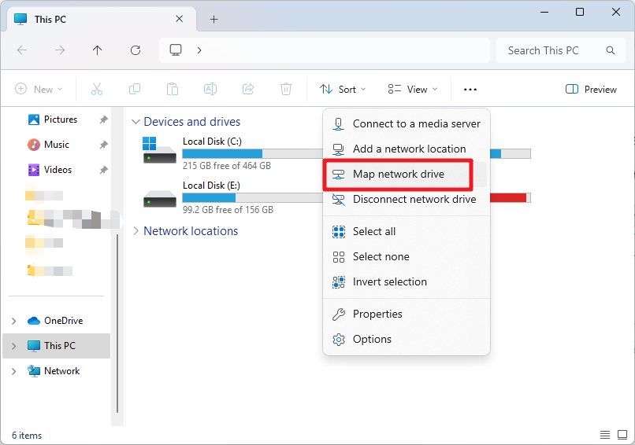

2. 在弹出的对话框中，在 ``Folder`` 字段中输入 Raspberry Pi 的 IP 地址，例如 ``\\192.168.1.100\``，或输入主机名，例如 ``\\pi.local\``。

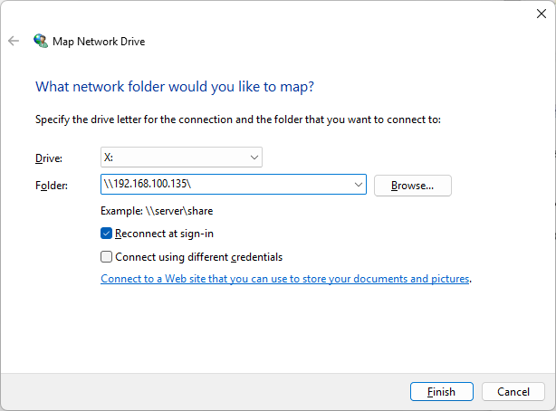

3. 点击浏览（Browse）按钮，然后选择要访问的共享文件夹。在此过程中，需要输入之前创建的用户名和密码。

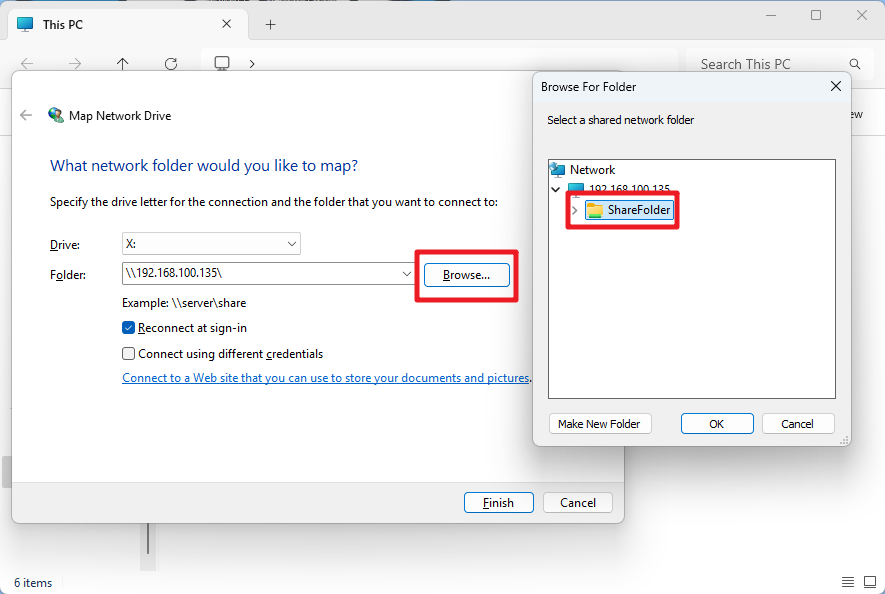

4. 勾选 “Reconnect at sign-in”（登录时重新连接），然后点击 ``Finish`` 按钮。

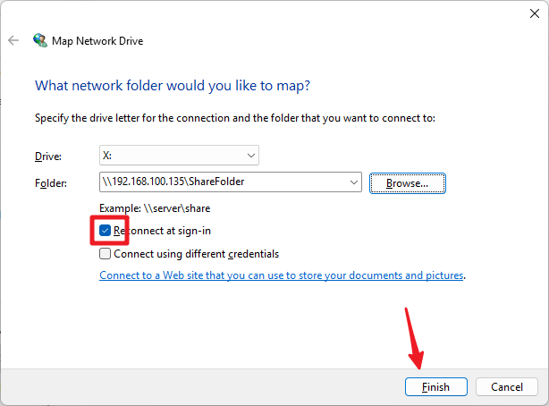
   
5. 现在即可访问 NAS 共享文件夹。

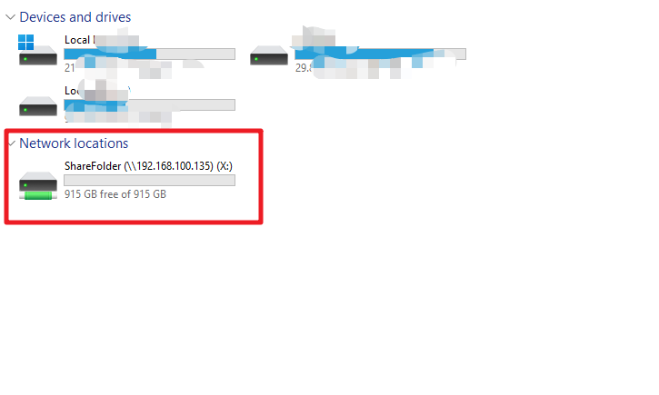

10. 在 Mac 上访问共享文件夹
-------------------------------------

1. 在 ``Go`` 菜单中，点击 ``Connect to Server``。

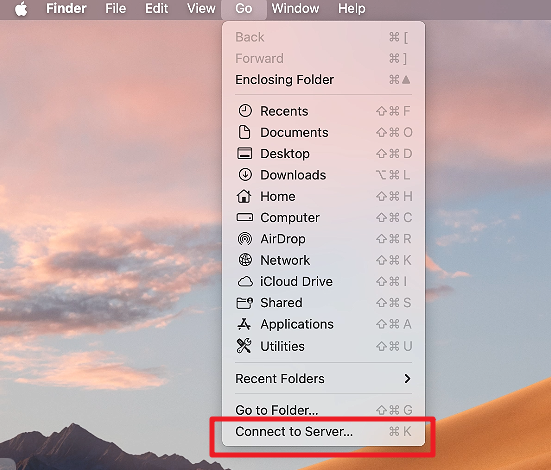

2. 在弹出的对话框中，输入 Raspberry Pi 的 IP 地址，例如 ``smb://192.168.1.100``，或输入主机名，例如 ``smb://pi.local``。

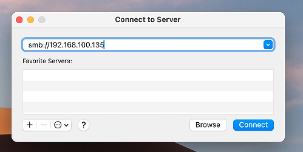

3. 点击 ``Connect`` 按钮。

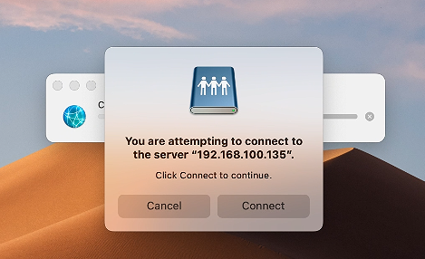

4. 在弹出的对话框中，输入之前创建的用户名和密码，然后点击 ``Connect`` 按钮。

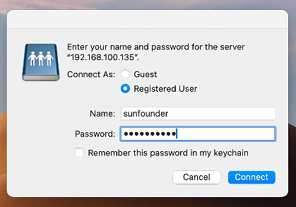

5. 现在即可访问 NAS 共享文件夹。

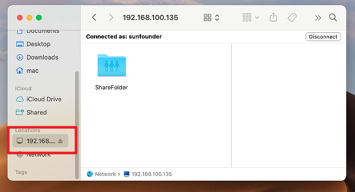