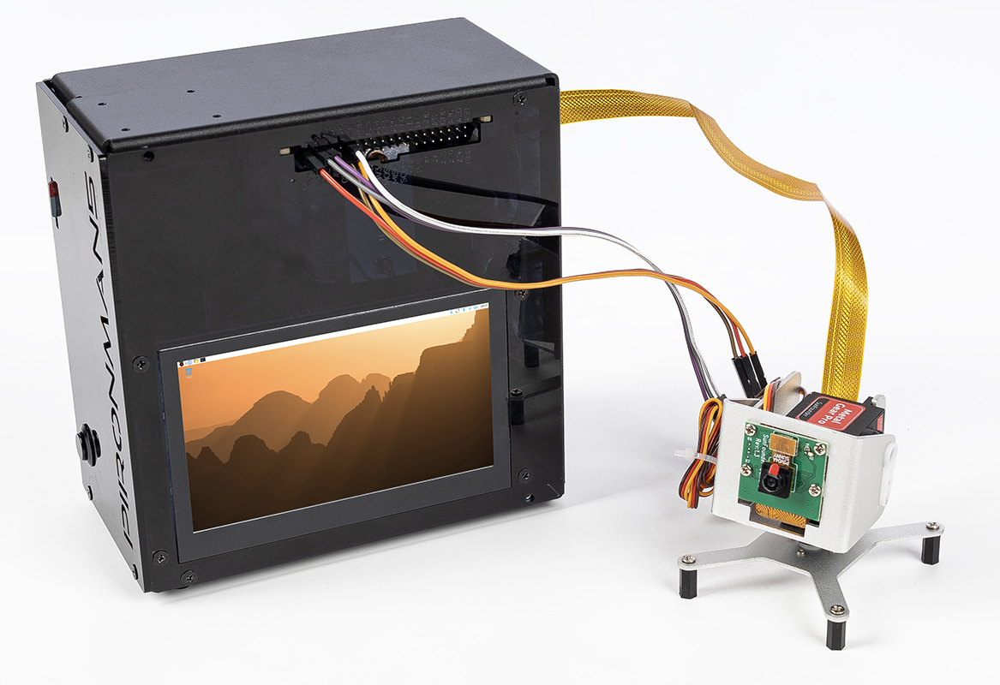

Pan-Tilt 摄像头模块
===========================================

.. note::

   Pironman 5 系列 **不包含摄像头模块**。  
   你需要自行准备，或从我们的官方网站购买：

   * `AI Funsion Lab Kit <https://www.sunfounder.com/products/sunfounder-ai-fusion-lab-kit>`_

在本章节中，你将学习如何使用两个 SG90 舵机，通过 GPIO 引脚控制一个云台（Pan-Tilt）摄像头模块。完成本节后，你将拥有一个已经安装并可正常工作的 Pan-Tilt 模块，可用于你的项目中。

硬件连接
-------------------------------------------

在开始之前，请确保 Raspberry Pi 已经关闭电源。

**连接示意：**

.. list-table::
   :header-rows: 1
   :widths: 30 20 50

   * - Device
     - GPIO Pin
     - Physical Pin
   * - Pan Servo (Orange)
     - GPIO17
     - Pin 11
   * - Tilt Servo (Orange)
     - GPIO18
     - Pin 12
   * - VCC (Red)
     - 5V
     - Pin 2 or 4
   * - GND (Brown)
     - GND
     - Pin 6, 9, 14, 20, 25, 30, 34, 39
   * - Camera Module
     - CSI Interface
     - Connect to camera port

.. warning::

   虽然 SG90 舵机在测试时可以直接从 Raspberry Pi 的 5V 引脚供电，但长时间使用或两个舵机同时运动可能会导致电压下降，从而引起系统不稳定。  
   在长期项目中，建议使用 **外部 5V 电源** （并确保与 Raspberry Pi 共地）。

**连接步骤：**

1. **连接舵机：**

   - 将 Pan 舵机的橙色信号线连接到 GPIO17（物理引脚 11）
   - 将 Tilt 舵机的橙色信号线连接到 GPIO18（物理引脚 12）
   - 将两个舵机的红色 VCC 线连接到 5V 引脚（物理引脚 2 或 4）
   - 将两个舵机的棕色 GND 线连接到任意 GND 引脚（例如物理引脚 6）

2. **连接摄像头：**

   - 轻轻掀起 CSI 摄像头接口的塑料卡扣
   - 插入摄像头排线，使金属触点 **朝向远离以太网接口的一侧**
   - 将塑料卡扣压回去以固定排线

测试舵机
-------------------------------------------

在运行完整的 Pan-Tilt 示例之前，我们先分别测试每个舵机，确保它们工作正常。

**1. 启用 GPIO 和 I2C（如果需要）：**

.. code-block:: bash

   sudo raspi-config
   # Navigate to: Interface Options -> I2C -> Enable
   # Reboot after enabling

**2. 简单的舵机测试脚本：**

创建测试文件 ``servo_test.py``：

.. code-block:: python

    #!/usr/bin/env python3
    # servo_test.py - Simple servo test

    from gpiozero import Servo
    import time

    # Test Pan servo on GPIO17
    pan = Servo(17, min_pulse_width=0.5/1000, max_pulse_width=2.5/1000)
    
    print("Testing Pan servo (GPIO17)...")
    print("Moving to 0° position...")
    pan.value = -1  # 0°
    time.sleep(2)
    
    print("Moving to 90° position...")
    pan.value = 0   # 90°
    time.sleep(2)
    
    print("Moving to 180° position...")
    pan.value = 1   # 180°
    time.sleep(2)
    
    pan.close()
    print("Pan servo test complete")

**3. 运行测试：**

.. code-block:: bash

   python3 servo_test.py

如果舵机能够平滑地在各个角度之间移动，则说明工作正常。  
然后将引脚改为 18，再测试 Tilt 舵机。

测试摄像头
-------------------------------------------

**1. 启用摄像头接口：**

.. code-block:: bash

   sudo raspi-config
   # Navigate to: Interface Options -> Camera -> Enable
   # Or for newer systems: Interface Options -> Legacy Camera -> Enable
   sudo reboot

**2. 测试摄像头拍摄：**

对于 Raspberry Pi OS Bullseye 及更新版本（使用 libcamera）：

.. code-block:: bash

   # Take a test photo
   libcamera-jpeg -o test.jpg -t 2000 --width 640 --height 480
   
   # Preview camera feed
   libcamera-hello -t 0

对于较旧系统（使用 raspistill）：

.. code-block:: bash

   # Take a test photo
   raspistill -o test.jpg -t 2000 -w 640 -h 480
   
   # Preview camera feed
   raspivid -t 0

**3. 验证照片：**

.. code-block:: bash

   ls -l test.jpg
   # Open the image (if you have a GUI)
   xdg-open test.jpg

Pan-Tilt 示例
-------------------------------------------

现在我们将舵机控制与摄像头功能结合，创建一个完整的云台控制程序。  
该示例支持使用 **WSAD 键控制方向**，并通过 **T 键拍照**。

**1. 创建控制脚本：**

.. code-block:: bash

   nano ptz_wsad_simple.py

复制以下代码：

.. code-block:: python

    #!/usr/bin/env python3
    # -*- coding: utf-8 -*-
    # ptz_wsad_simple.py - Control PTZ with WSAD keys, ultra simple version

    from gpiozero import Servo
    import os
    from datetime import datetime

    # Initialize servos
    # SG90 parameters: min pulse width 0.5ms (0°), max pulse width 2.5ms (180°)
    pan = Servo(17, min_pulse_width=0.5/1000, max_pulse_width=2.5/1000)
    tilt = Servo(18, min_pulse_width=0.5/1000, max_pulse_width=2.5/1000)

    # Initial position (center)
    pan.value = 0
    tilt.value = 0

    print("\n=== SG90 PTZ Control ===")
    print("W: Up")
    print("S: Down")
    print("A: Left")
    print("D: Right")
    print("T: Take photo")
    print("C: Center")
    print("Q: Quit")
    print("-" * 30)

    def take_photo():
        """Take photo function"""
        # Create photo directory if it doesn't exist
        photo_dir = "/home/pi/Pictures/ptz"
        os.makedirs(photo_dir, exist_ok=True)
        
        # Generate filename with timestamp
        timestamp = datetime.now().strftime("%Y%m%d_%H%M%S")
        filename = f"{photo_dir}/ptz_{timestamp}.jpg"
        
        # Take photo using libcamera (for Raspberry Pi Bullseye and above)
        # Alternative for older systems: use raspistill
        os.system(f"libcamera-jpeg -o {filename} -t 1 --width 640 --height 480")
        
        # Alternative command for older systems:
        # os.system(f"raspistill -o {filename} -t 1 -w 640 -h 480")
        
        print(f"Photo saved: {filename}")

    try:
        while True:
            # Get user input
            cmd = input("Enter command: ").lower().strip()
            
            if cmd == 'w':
                # Move up (increase tilt angle)
                tilt.value = min(1.0, tilt.value + 0.2)
                print(f"↑ Up ({tilt.value:.1f})")
                
            elif cmd == 's':
                # Move down (decrease tilt angle)
                tilt.value = max(-1.0, tilt.value - 0.2)
                print(f"↓ Down ({tilt.value:.1f})")
                
            elif cmd == 'a':
                # Move left (decrease pan angle)
                pan.value = max(-1.0, pan.value - 0.2)
                print(f"← Left ({pan.value:.1f})")
                
            elif cmd == 'd':
                # Move right (increase pan angle)
                pan.value = min(1.0, pan.value + 0.2)
                print(f"→ Right ({pan.value:.1f})")
                
            elif cmd == 't':
                # Take photo
                take_photo()
                
            elif cmd == 'c':
                # Center the PTZ
                pan.value = 0
                tilt.value = 0
                print("PTZ centered")
                
            elif cmd == 'q':
                # Quit program
                print("Exiting program")
                break
                
            else:
                print("Invalid command, please use W/S/A/D/T/C/Q")
                
    except KeyboardInterrupt:
        print("\nProgram interrupted by user")
        
    finally:
        # Clean up GPIO resources
        pan.close()
        tilt.close()
        print("GPIO cleaned up")

**2. 赋予脚本可执行权限：**

.. code-block:: bash

   chmod +x ptz_wsad_simple.py

**3. 运行 Pan-Tilt 控制程序：**

.. code-block:: bash

   python3 ptz_wsad_simple.py

**4. 控制摄像头：**

- 按 **W/S** 控制俯仰向上/向下
- 按 **A/D** 控制水平向左/向右
- 按 **T** 拍照（照片将保存到 ``/home/pi/Pictures/ptz/``）
- 按 **C** 将摄像头恢复到居中位置
- 按 **Q** 退出程序

**摄像头拍摄：**

该脚本使用 ``libcamera-jpeg`` （适用于较新的 Raspberry Pi OS 版本）进行拍照。  
照片会自动按时间戳命名保存，以避免被覆盖。