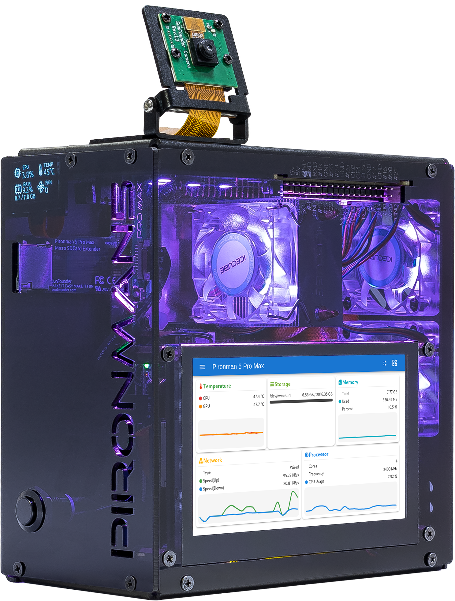

.. _promax_set_up_pi_os:

在 Raspberry Pi / Ubuntu / Kali / Homebridge 上设置
===============================================================

如果你在 Raspberry Pi 上安装了 Raspberry Pi OS、Ubuntu、Kali Linux 或 Homebridge，则需要通过命令行来配置 Pironman 5 Pro MAX。详细步骤如下：

.. note::

   在开始配置之前，请先启动并登录 Raspberry Pi。  
   如果不确定如何登录，可以访问官方指南：|link_rpi_get_start|。

配置关机后关闭 GPIO 供电
------------------------------------------------------------

为了防止关机后由 GPIO 供电的 **OLED 屏幕和 RGB 风扇仍然工作**，需要设置 Raspberry Pi 在关机时关闭 GPIO 电源。

#. 打开 EEPROM 配置工具：

   .. code-block::

      sudo raspi-config

#. 进入 **Advanced Options → A12 Shutdown Behaviour**

   .. image:: img/shutdown_behaviour.png

#. 选择 **B1 Full Power Off**

   .. image:: img/run_power_off.png

#. 保存设置，并根据提示重启系统以生效。

.. _promax_download_pironman5_module:

下载并安装 ``pironman5`` 模块
-----------------------------------------------------------

.. note::

   如果你使用的是 Lite 系统，需要先安装基础工具（如 ``git``、 ``python3``、 ``pip3`` 等）：

   .. code-block:: shell

      sudo apt-get install git -y
      sudo apt-get install python3 python3-pip python3-setuptools -y

#. 从 GitHub 下载代码并安装 ``pironman5`` 模块：

   .. code-block:: shell

      cd ~
      git clone -b pro-max https://github.com/sunfounder/pironman5.git --depth 1
      cd ~/pironman5
      sudo python3 install.py

   安装完成后需要 **重启系统** 才能生效，请按照提示执行重启。

   重启后，``pironman5.service`` 会自动启动，默认行为如下：

   * OLED 屏幕显示 CPU、内存、磁盘使用率、CPU 温度和 IP 地址  
   * 4 个 WS2812 RGB LED 以蓝色呼吸模式亮起  

#. 你可以使用 ``systemctl`` 管理 ``pironman5.service``：

   .. code-block:: shell

      sudo systemctl restart pironman5.service

   * ``restart``：应用配置更改  
   * ``start/stop``：启动或停止服务  
   * ``status``：查看服务运行状态  

.. note::

   至此，你已经成功完成 Pironman 5 Pro MAX 的设置，可以开始使用。

   如需更高级的控制功能，请参考 :ref:`control_commands_dashboard_promax`。